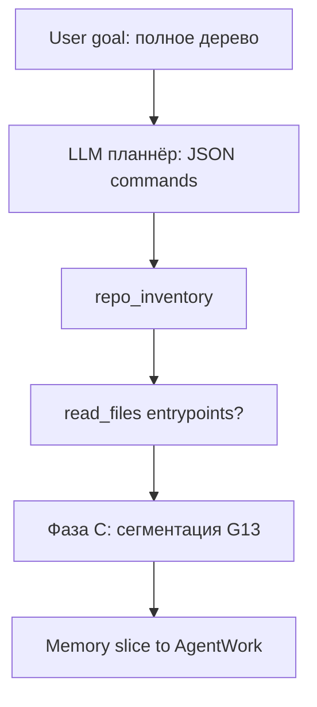

# Workflow 14: жёсткий контракт команд LLM → AgentMemory runtime

**Идентификатор:** `agent-memory-planner-command-contract-14` (файл `plan/14-agent-memory-planner-command-contract.md`).

**Статус:** **суперсeded** рабочим планом **[`plan/14-agent-memory-runtime.md`](14-agent-memory-runtime.md)** (W14R, G14R.*). Этот файл остаётся **историческим** контекстом (G14.1–G14.6, enum `op`, идеи `repo_inventory` / path dispatch). Нормативный runtime и DoD: W14R (закрыт G14R.11).

Канон процесса: [`.cursor/rules/project-workflow.mdc`](../.cursor/rules/project-workflow.mdc). Референс закрытого тела памяти: [`plan/13-agent-memory-contract-recovery.md`](13-agent-memory-contract-recovery.md), [`plan/11-agent-memory-llm-journal.md`](11-agent-memory-llm-journal.md).

---

## 1. Цель и границы

### 1.1 Зачем

1. **Убрать семантическую двусмысленность** поля `requested_reads` в текущем planner-промпте: модель подставляет **namespace** вместо **relpath к файлу**, а рантайм трактует это как путь, не находит файла и **падает в эвристику** (`goal_terms` / `entrypoint`, см. `PATH_SEL_*` в `tools/agent_core/runtime/memory_growth.py`, аудит `planner_path_heuristic_fallback` в `tools/agent_core/runtime/subprocess_agents/memory_agent.py`).
2. **Нормализовать ответ LLM** в виде **только JSON** с **командами** из **закрытого enum**; у каждой команды **обязательна** `reason` (человекочитаемо, для журнала и логов, не подменяет исполнение).
3. **Связать команды с детерминированным исполнением** в `AgentMemory` (одна таблица dispatch → ровно один путь в коде на операцию), а не с «толкованием» свободного текста.
4. **Сохранить** существующие G13-инварианты: `memory.query_context`, PAG writes через согласованные сервисы, compact slice в AgentWork, **без** raw chain-of-thought в событиях.

### 1.2 Вне scope (запрещено расширять без отдельной постановки)

- Замена провайдера LLM, обучение модели.
- Полный `ls` без капа на больших репо (нужен **жёсткий** budget из конфига, см. C14.4).
- Произвольный Python/code execution из JSON планнера.
- Смена контракта `pag.node.upsert` / desktop delta transport (кроме **добавления** новых audit-топиков, согласованных с C14.6).

---

## 2. Аудит текущего состояния (source of truth)

| ID | Находка | Символ/файл (якорь) |
|----|---------|----------------------|
| **A14.1** | Системный промпт планнера описывает плоскую схему `requested_reads: {path, reason}`; нет **отдельного** `op` для обхода репозитория. **Запрещённый** ввод (namespace в `path`) **не** отсекается на границе. | `PLANNER_SYSTEM` в `tools/agent_core/runtime/agent_memory_query_pipeline.py` (примерно `35-48`); извлечение `rels` в `run()` (`268-281`). |
| **A14.2** | Выбор файлов для query-driven роста — `MemoryExplorationPlanner.select_paths` → `PathSelectOutcome` с `explicit` / `goal_terms` / `entrypoint` / `none`. Нет типа **«проинвентаризировать репо»** как первого шага. | `tools/agent_core/runtime/memory_growth.py` (класс `MemoryExplorationPlanner`, `QueryDrivenPagGrowth._grow_impl`). |
| **A14.3** | Поля `partial`, `recommended_next_step` в ответе планнера **advisory** для лога; **не** запускают второй раунд или обязательное продолжение. | `AgentMemoryQueryPipeline` / парсинг `plan_obj` в `agent_memory_query_pipeline.py`. |
| **A14.4** | C-уровень и `c_upserts` / `link_claims` остаются в контуре G13; новый контракт **должен** сосуществовать с ними (см. C14.1 «композиция с legacy полями») или явно **deprecated** с датой и миграцией — в рамках G14.2 выбрать одно **жёстко** (см. решение D14.2). | `plan_obj.get("c_upserts")` в том же пайплайне. |
| **A14.5** | Аудит «эвристика вместо явных relpath» уже пишет `topic=planner_path_heuristic_fallback`. Новая схема **должна** **снизить частоту** этого события и добавить **корреляцию** `command_id` / `op` (C14.6). | `tools/agent_core/runtime/subprocess_agents/memory_agent.py` (блок `planner_path_heuristic_fallback` после `query_driven_pag_growth`). |

**Локальный репозиторий-референс (идеи, не копипаст):** в `/home/artem/reps/opencode` — typed events / строгие DTO; полезно удерживать **один** enum команд и тонкий dispatch.

---

## 3. Контракты (норматив)

### 3.1 C14.1: Planner response JSON (версия `agent_memory_planner.v1`)

**Обязательно:** `schema_version: "agent_memory_planner.v1"`. Без неё — `parse` failure → ветка A4-совместимого фолбэка (см. D14.1).

**Тело ответа:**

| Поле | Required | Тип | Правило |
|------|----------|-----|--------|
| `schema_version` | да | `string` | **Ровно** `agent_memory_planner.v1` (до смены мажорной ветки). |
| `commands` | да | `array` | **Минимум 0 элементов** (пустой массив = «ничего не делать, только срез/кэш» — тогда обязателен `decision_summary`). **Максимум** `N` — из конфига (C14.4), default **8**. |
| `commands[]` | да | `object` | См. C14.2. |
| `c_upserts` | **запрещён** в v1, если D14.2=replace | — | Иначе optional — см. D14.2. |
| `link_claims` | нет | `array \| null` | `null` или массив; пустой массив = «нет ссылок». |
| `decision_summary` | да | `string` | ≤ 500 символов, без markdown code fence. |
| `partial` | да | `boolean` | `true` = **не** все команды гарантированно выполнены **или** срез неполный. |
| `recommended_next_step` | если `partial=true` | `string` | Обязателен при `partial=true`, иначе `""` (пустая строка). |
| `legacy` | нет | `object \| null` | Только при D14.2=coexist: старые `requested_reads` и т.д. **запрещено** в прод-пути по умолчанию. |

**Do not implement as:** свободный `path: string` без `op` как единственный механизм «сходить в репо» — **anti-pattern** (A14.1).

### 3.2 C14.2: Команда `commands[]` (машинный `op` + `reason`)

| Поле | Required | Тип | Правило |
|------|----------|-----|--------|
| `id` | нет | `string` | Стабильный id **внутри ответа** (например `cmd-1`); при отсутствии — runtime присваивает порядковый. |
| `op` | да | `string` enum | Только из whitelist (см. **C14.3**). Любое другое — **валидационная ошибка** → `partial=true`, команда пропущена, журнал `planner_command_rejected`. |
| `params` | да | `object` | Для данного `op` — **строгий** pod-схемой (C14.3). Пустой объект **запрещён**, если `op` требует params. |
| `reason` | да | `string` | 1–400 символов, объяснение **для оператора/аудита**; **не** исполняется как код. |

### 3.3 C14.3: Whitelist `op` (MVP, расширение только + этап + тест)

| `op` | `params` (required keys) | Исполнение (runtime) |
|------|--------------------------|----------------------|
| `repo_inventory` | `max_files` (int, 1..`cfg.max_inventory_files`) | Ограниченный **обход** `project_root` (тот же игнор каталогов, что `_IGNORE_DIRS` в `memory_growth.py`), запись/обновление A/B в PAG через **существующий** `PagIndexer`/`QueryDrivenPagGrowth` **без** подмены `path` namespace. |
| `read_files` | `paths: string[]` (каждый — relpath от **корня проекта**; `..` **запрещён**; **не** совпадает с `namespace` строки) | Индексация/рост PAG **только** валидных путей; невалидные — `non_matching_explicit_paths` + журнал. |
| `use_graph_as_is` | `{}` (пустой объект) | **Не** грузить с диска; только `PagRuntime` slice по goal (существующая логика). |
| `noop` | `{"stop": true}` (фиксировано) | Явная остановка цепочки; остальные `commands` **не** исполняются (MVP: запрет смешивать `noop` с другими — **валидация**). |

**Default после внедрения:** при цели уровня «**что это за репозиторий**» планнер **обязан** выдать `repo_inventory` первым; затем `read_files` **с валидными relpath** (не namespace), если нужен текст для summary. Запрещён «выдуманный» relpath вместо inventory.

**Anti-pattern:** `read_files` с `paths: ["<namespace>"]` — **validation error**; не передавать в `select_paths` как file.

#### 3.3.1 Справочник команд (что пишет LLM → что делает рантайм)

Один элемент `commands[]` = **одна** команда. Поле `reason` — **для людей/логов**; **исполнение** определяется **только** `op` + `params`.

| `op` | Смысл для планнера (человекочитаемо) | Что делает runtime (детерминировано) | Минимальный пример (фрагмент JSON) |
|------|--------------------------------------|--------------------------------------|-------------------------------------|
| `repo_inventory` | «Сходить по дереву **файлов** от `project_root` вниз, до капа `max_files`, **не** путая корень с namespace.» | Ограниченный `os.walk` (с игнором из `_IGNORE_DIRS` в `memory_growth.py`), для каждого увиденного пути: индексация в PAG (`PagIndexer` / `QueryDrivenPagGrowth`): как минимум A-проект и B-файл + **containment**-связи, согласованные с `tools/agent_core/memory/pag_indexer.py` / `PagGraphWriteService` в G14.2. | `"op": "repo_inventory", "params": { "max_files": 2000 }, "reason": "Перечислить файлы репозитория в пределах лимита."` |
| `read_files` | «**Убедиться**, что перечисленные пути **как файлы** учтены в PAG (и **цепочка** от A до листа — см. C14.8) и **проиндексированы/прочитаны** для среза.» | Валидация relpath (не `..`, не `namespace`); **обязателен** C14.8; затем `sync`/`index` путей как сейчас G13. | `"op": "read_files", "params": { "paths": ["a/b/toggle.c"] }, "reason": "..."` |
| `use_graph_as_is` | «**Не** ходить на диск; взять текущий PAG.» | Только построение slice / digest без `grow`. | `"op": "use_graph_as_is", "params": {}, "reason": "Контекст уже в графе."` |
| `noop` | «**Остановить** цепочку команд.» (MVP: **только** одна команда в `commands`.) | Дальше по массиву `commands` **не** идти. | `"op": "noop", "params": { "stop": true }, "reason": "Достаточно кэша."` |

**Расширение (целевое, G14.2+ / отдельный sub-этап, не путать с «второй фразой планнера» D14.3):** `c_segment_for_paths` — params `paths: string[]`, «для заданных relpath **запустить** G13-контур C-сегментации (механический / LLM chunk), пока **не** второй **планнер**». Имя и **ровно** один путь в код (например `agent_memory_query_pipeline` → `MemoryExploration` / `memory_c_segmentation.py`) **фиксируются** в G14.2. До введения `c_segment_for_paths` в whitelist **полное** «дерево до C» **не** считается закрытым в §6.2.

**C14.8 (materialize path / ancestry):** для каждого `relpath` в `read_files` runtime **idempotent**: до записи/индекса B-**файла** `path` **обязан** существовать **согласованный** с PAG G13 **кусок** от A до файла: как минимум `A:project` **--contains-->** `B:<path>`. Если **в** целевой схеме PAG (см. `plan/13` / `pag_indexer`) **предусмотрены** узлы **для** каталогов, **G14.2** **обязан** при отсутствии предков создать **и** B-dir / synthetic nodes с **явными** рёбрами containment; если в текущей схеме **только** B-**файл** с `path="a/b/toggle.c"`, **достаточно** одного B-узла + ребра от A, **при** том что **текстовый** path **отражает** `a/`, `b/`. **Выбор** варианта — **one** (зафиксировать в G14.2 + тест), **запрещена** ситуация B-листа **без** пути в графе от A.

### 3.4 C14.4: Config (source of truth)

| Ключ | Где | Default | Правило |
|------|-----|---------|--------|
| `planner.max_commands` | `AgentMemory` / merged ailit config (см. `load_merged_ailit_config_for_memory` в `tools/agent_core/runtime/`) | `8` | Truncate + лог. |
| `planner.max_inventory_files` | то же | `2000` | **Жёсткий** кап `repo_inventory` (согласован с `max_walk_files` в `MemoryExplorationPlanner.__init__`). |
| `planner.strict_json_schema` | policy LLM | из существующей политики | При `true` — провайдеру передаётся `response_format` под C14.1, если backend поддерживает. |

**Тестовая изоляция:** override через env/`AILIT_CONFIG_DIR` в `tests/conftest` — как в правилах workflow.

### 3.5 C14.5: Ownership

- **Парсинг + валидация** — `AgentMemoryQueryPipeline` (или вынесенный модуль `planner_command_contract.py` **под** тем же пакетом, но **вызов** из того же `run()` пути).  
- **Исполнение** `repo_inventory` / `read_files` — `QueryDrivenPagGrowth` / `PagIndexer` (anchors ниже), **без** дублирования `os.walk` в третьем месте — один helper из `MemoryExplorationPlanner` или shared module.

### 3.6 C14.6: Observability (журнал + chat log)

| Событие (topic / journal) | Когда | Compact payload (без секретов, без full prompt) |
|---------------------------|-------|--------------------------------------------------|
| `planner_command_plan_parsed` | JSON прошёл схему v1 | `schema_version`, `op[]` order, `partial` |
| `planner_command_rejected` | `op` не в whitelist / params invalid | `op`, `id`, `error_code` (enum) |
| `planner_path_heuristic_fallback` | (уже есть) | Должно **реже** срабатывать; payload дополнить `replaced_by: "repo_inventory"` при успешной замене |
| `inventory_cap_hit` | `repo_inventory` остановлен по `max_files` (G14.2) | `max_files`, `files_seen`, `truncated: true` |
| `c_segmentation_incomplete` (или согласованное имя, D14.3b) | C не применён ко **всем** целевым файлам | `target_paths_count`, `segmented_count` |
| `memory.index.*` | как сейчас | + `last_command_id` (optional) |

**Запрещено** в payload: full system prompt, chain-of-thought, содержимое всех прочитанных файлов.

### 3.7 Решения (decisions)

| ID | Текст |
|----|--------|
| **D14.1** | Фолбэк при невалидном JSON/схеме: **сохраняем** текущий поведение G13 (`_partial_json_fallback`, A4) **один релиз**; в логе `planner_schema_fallback=true`. |
| **D14.2** | **Coexist (рекомендовано для G14.2):** планнер **одновременно** может не слать `commands`; тогда `requested_reads` обрабатывается как **legacy** с **явным** `legacy_mode=true` в ответе. После 1 релиза **удалить** `requested_reads` из `PLANNER_SYSTEM` (отдельная задача G14.3). **Альтернатива (строже):** `replace` — в первом PR только `commands`, legacy поля игнорировать. **Выбрать одно в начале G14.2, зафиксировать в коммите.** |
| **D14.3** | Один **HTTP-вызов** **планнера** (одна фаза `planner` / один completion с JSON) на `memory.query_context` в MVP, если иное **не** закреплено конфигом W14+2. |
| **D14.3a** | **Не** путать планнера с **C-сегментацией** (G13). После исполнения `commands` **разрешён** (и **должен** быть **предусмотрен** в §6.2) **детерминированный** внутренний цикл: *рубеж планнера* → *исполнение op* → *фаза C* (другой промпт/другой `phase` в журнале, **не** новый `topic=planner` как второй free-form JSON-ответ). `partial` на выходе планнера ≠ «не начинать C»; `partial` = «не весь объём цели закрыт» (например, cap `repo_inventory` или C не для всех файлов). |
| **D14.3b** | Если **один** `memory.query_context` **не** завершает C для **всех** файлов в лимитах — итоговый `memory_slice` + журнал: `c_segmentation_incomplete: true` (имя **зафиксировать** в C14.6 при G14.2). |

---

## 4. Таблица трассировки: ID → этап

| ID | Этап (обязан закрыть) |
|----|------------------------|
| A14.1 – A14.5 | G14.1 (аудит зафиксирован в реализации якорями) |
| C14.1 – C14.8, D14.1 – D14.3b | G14.2, G14.3, G14.4 |
| Anti-pattern «namespace as path» | G14.2 (тест ломается) |
| DoC / smoke | G14.6 |

---

## 5. Этапы

### G14.1 — Design freeze: схема + diff к PLANNER_SYSTEM

- **Обязательные выводы:** C14.1, C14.2, C14.3, D14.1, D14.2 (черновик) зафиксированы **в этом файле** (секция 3); при расхождении с кодом — приоритет **обновлённого плана** после PR review.  
- **Реализация:** **нет**; только **уточнения в `plan/14-*.md`** по результатам review (отдельный PR при расхождении с кодом).  
- **Проверка:** `rg "agent_memory_planner.v1" plan/14*.md` → ≥1.  
- **Реализация anchors:** неприменимо.  

### G14.2 — `commands` dispatch + `repo_inventory` + валидация `read_files`

- **Обязательные выводы:** C14.3, C14.5, A14.1 (устранение двусмысленности), D14.2 (выполнен выбор).  
- **Реализация anchors (обязательны к изменению/ревью):**  
  - `tools/agent_core/runtime/agent_memory_query_pipeline.py` — разбор `commands`, legacy, вызов исполнителя.  
  - `tools/agent_core/runtime/memory_growth.py` — `repo_inventory` (переиспользование walk/лимитов) **или** новый модуль **импортируемый отсюда** (один DRY walk).  
  - `tools/agent_core/runtime/subprocess_agents/memory_agent.py` — связка `grow` / journal / `planner_path_heuristic_fallback`.  
- **Anti-patterns (не считать закрытым этапом, если…):**  
  - **не** внедрить проверку `path != namespace` на границе `read_files`;  
  - **не** добавить enum-ish константы `op` (хотя бы `Final[str]` + регистр в тесте).  
- **Exact tests (имена):**  
  - `test_repo_inventory_respects_max_files`  
  - `test_read_files_rejects_parent_paths_and_namespace`  
  - `test_planner_rejects_unknown_op`  
  - `test_read_files_ensures_c14_8_ancestry_chain` (идемпотентное A→…→B для вложенного relpay)  
- **Статичные проверки:** `flake8` на изменённых файлах; `rg "requested_reads" agent_memory_query_pipeline.py` — при D14.2=coexist: ≥1; при replace: 0 **после** G14.3.  

### G14.3 — Промпт LLM: только v1, примеры few-shot, строгий `response_format` где доступно

- **Обязательные выводы:** C14.1 (текст промпта соответствует), D14.3.  
- **Реализация anchors:** `PLANNER_SYSTEM` в `agent_memory_query_pipeline.py`; **если** в конфиге включён `strict_json_schema` — тот же путь, что `load_merged_ailit_config_for_memory` / `build_chat_provider_for_agent_memory` (см. `tools/agent_core/runtime/agent_memory_ailit_config.py`).  
- **Anti-patterns:** «опиши в свободной форме пути к файлам» в system prompt.  
- **Exact tests:**  
  - `test_planner_user_payload_includes_schema_version_reminder` (снапшот/подстрока)  
- **Статичные:** нет `requested_reads` в system без пометки `legacy` (если D14.2=coexist).  

### G14.4 — Регресс G13: `memory.query_context` + slice

- **Обязательные выводы:** A14.3 (partial semantics документированы = advisory).  
- **Реализация anchors:** существующие `tests/test_g13_agent_memory_llm_pipeline.py`, `tests/test_g13_agent_memory_contract_integration.py` — **зелёны**; добавить **ровно** интеграционный сценарий `test_query_context_happy_path_with_v1_planner` (mock provider с телом v1).  
- **Exact test:** `test_query_context_happy_path_with_v1_planner` (обязательное имя; новый тест **или** расширение существующего с `mock` provider — выбрать в PR G14.4, не оставлять дубли).  

### G14.5 — Канон `context/*` (кратко)

- **Обязательные выводы:** ссылка на C14.1 в **`context/proto/`** (новый фрагмент **или** дополнение `runtime-event-contract.md` — секция «Memory planner v1»), не дублирование всего `plan/14`.  
- **Проверка:** ссылка из `context/INDEX.md` (одна строка).  

### G14.6 — DoD: сквозной сценарий

- **Обязательные:** от `service.request` `memory.query_context` с goal до: PAG/журнал/slice, тест G14.4, обновлённый README (строка статуса W14), ручной smoke.  
- **Manual smoke (1 раз человеком):** поднять `ailit` с тестовым репо; goal «О чем репо»; убедиться в `chat_logs` наличие `planner_command_plan_parsed` и **отсутствие** `planner_path_heuristic_fallback` в типичном случае (если PAG пуст / README есть).  
- **Dependencies:** G14.2 **до** G14.3 если промпт ссылается на **реальные** имена `op` в коде.  

---

## 6. Примеры: согласование goal → план (JSON) → runtime

**Общие правила для всех сценариев:**

- `project_root` — **единственный** корень ФС; любой `path` в `read_files` — **relpath** в стиле POSIX (сегменты `/`, **без** ведущего `/`, **без** `..` — C14.3). Пример глубины 3 от корня: `src/lib/toggle.c` **не** `.../project/src/...` абсолютный.  
- **User JSON** в планнер: `{"goal": "<фраза>", "namespace": "<...>", "explicit_paths": []}` **или** список relpath, если UI/AgentWork их уже знал. Подставлять **строку namespace** в `explicit_paths` как путь **запрещено** (A14.1).  
- **Планнёр** (внешний LLM-вызов с `PLANNER_SYSTEM`) — **один** на запрос (D14.3). **После** ответа JSON и исполнения `op` **отдельно** разрешена **фаза C** (другой LLM-вход / механика G13) — D14.3a; **не** считать «вторым планнёром».  
- Ниже **ожидаемый** (не единственно допустимый) JSON планнера: модель **может** переупорядочить `commands`, **если** направлено рёбрами зависимостей (нельзя `read_files` до `repo_inventory`, **если** **требуется** сначала **узнать** список путей — **кроме** заранее заданного `explicit_paths` от AgentWork).

**Общие шаги 1–2 (политика + LLM-запрос) для §6.1–6.3:**  
`MemoryLlmOptimizationPolicy` при `enabled=True` → причина A5; `messages[0]=system` (C14.1, новый `PLANNER_SYSTEM`), `messages[1].role=user` = user JSON как выше.

### 6.1 «О чем данный репозиторий»

**Вход:** `goal="О чем данный репозиторий"`, `query_kind=task` (или `inquiry` — **зафиксировано** в DTO AgentWork), `project_root=/path/to/repo`, `namespace` (например `_home_…_repo`).

**Шаг 3 — ожидаемый валидный JSON (MVP, один раунн):**

```json
{
  "schema_version": "agent_memory_planner.v1",
  "commands": [
    {
      "id": "1",
      "op": "repo_inventory",
      "params": { "max_files": 2000 },
      "reason": "Сначала получить ограниченный перечень файлов проекта, чтобы сориентироваться в структуре."
    },
    {
      "id": "2",
      "op": "read_files",
      "params": { "paths": ["README.md"] },
      "reason": "Корневой README чаще всего описывает назначение репозитория; прочитать в первую очередь."
    }
  ],
  "link_claims": [],
  "decision_summary": "Инвентаризация корня и чтение README для ответа на вопрос о сути репозитория.",
  "partial": false,
  "recommended_next_step": ""
}
```

**Шаг 4 — runtime (детерминированно):**

1. `parse` → `schema_version` **OK** → `commands` [inventory, read_files].  
2. `repo_inventory`: walk под `max_files` → `PagIndexer.sync_changes` / A/B, **без** подмены `path=namespace`.  
3. `read_files`: **только** `README.md` relpath — в `select_paths`/`grow` **явные** file hits → `path_selection_source=explicit` (константа `PATH_SEL_EXPLICIT` в `tools/agent_core/runtime/memory_growth.py`).  
4. Slice: `build_slice_for_goal` / D-tier, как W13.  
5. **Событие** `planner_path_heuristic_fallback` — **ожидается НЕ** сгенерироваться. Если README отсутствует, `read_files` помечается `partial` или `planner_command_rejected` на путь, **а не** тихий fallback на `README` из `entrypoint`.

**Шаг 5 — фоллёк, если в репо нет README (иллюстративно):** модель может (`partial: true`, `recommended_next_step` заполнен) вернуть `read_files` с существующим `pyproject.toml` или `package.json` — **MVP** не требует **второго** вызова **планнёра**; пользователь/AgentWork видит partial slice. (Фаза C, если нужна, — D14.3a; это **не** «второй планнёр».)

**Контраст с «сломанным» сценарием (A14.1):** старый план: `requested_reads: [{"path":"_…namespace…"}]` → `non_matching_explicit` → `entrypoint` → README. Новый: **невалидный** relpath в `read_files` **не** маскируется под **inventory**; inventory — **только** `op=repo_inventory`.

### 6.2 «Изучи данный репозиторий, посмотри каждый файл и построй дерево памяти»

**Целевой смысл:** **полное** «дерево» в смысле ПРОД-контракта W13/W14 = **(1)** A/B-оболочка + **(2)** **C** (фрагменты) **по каждому уместному файлу** **в** пределах cap и **бюджета** сегментации, **не** обязательно «одним JSON ответа планнера».

**Вход:** `goal` — фраза выше, `query_kind=task`, задан `project_root` и `namespace` (только id, **не** путь в ФС).

#### 6.2.1 Сквозной путь: LLM-планнёр → runtime (op) → C **без** второго «того же» планнера

| Шаг | Кто | Что происходит |
|-----|-----|----------------|
| 1 | **LLM (планнёр)**, 1× HTTP | Возвращает JSON C14.1. Типовой **набор** `commands` для «всё дерево»:**сначала** `repo_inventory` (с `max_files` = cap из C14.4), **затем** (например) `read_files` для entrypoints. Если `c_segment_for_paths` **уже** в whitelist: третьей командой `c_segment_for_paths` с `paths` = список relpath из **результата** инвентаризации, **усечённый** батч-лимиту. **Пока** `c_segment_for_paths` **не** в whitelist, планнёр ставит `partial: true` / честный `decision_summary` (A/B готово, C в пост-фазе G14) **или** полагается на **встроенную** пост-фазу G13 сразу после `commands` (доработка `AgentMemoryQueryPipeline`, G14.2). |
| 2 | **Runtime: dispatch** | Порядок: `repo_inventory` → A/B, рёбра; `read_files` где уместно; C14.8. |
| 3 | **Runtime: фаза C** (D14.3a) | **Не** второй **планнёр**, а G13-контур: либо `c_segment_for_paths` из того же JSON, либо `AgentMemoryQueryPipeline` после `commands` зовёт сегментацию по всем проиндексированным relpath в `cfg` (см. `tools/agent_core/runtime/memory_c_segmentation.py`). Один **выбранный** механизм в G14.2. **Журнал:** `phase=memory.c_segment` (или согласованный аналог), **не** `planner` повторно. |
| 4 | **Срез** | `build_slice_for_goal` / D-tier, как W13. Если C **не** для **всех** файлов → D14.3b + `partial: true` на **ответ** `memory.query_context`. |

**Mermaid (упрощённо, для чтения):**



**Нельзя** считать сценарий 6.2 **закрытым** только A/B из одного `repo_inventory` **без** (а) явно оговорённого **и** реализованного шага 3 **или** (b) `partial: true` с честной причиной (в релизе **ещё** нет C-пост-фазы / `c_segment_for_paths`).

**Пример JSON планнёра (только фаза 1 шага 1; фаза C — шаг 3 выше):**

```json
{
  "schema_version": "agent_memory_planner.v1",
  "commands": [
    {
      "id": "1",
      "op": "repo_inventory",
      "params": { "max_files": 2000 },
      "reason": "Список всех файлов (до cap) — основа A/B-дерева."
    },
    {
      "id": "2",
      "op": "read_files",
      "params": { "paths": ["README.md"] },
      "reason": "Entrypoint for narrative; остальные файлы — после индексации, для C в фазе 3."
    }
  ],
  "link_claims": [],
  "decision_summary": "A/B: repo_inventory. C-для-всех: см. G14.2+ и фазу C (D14.3a) или partial.",
  "partial": true,
  "recommended_next_step": "Сегментация C по списку проиндексированных файлов (внутренний цикл, не повтор планнера)."
}
```

(Если в релизе **уже** `c_segment_for_paths` и хватили cap/бюджет C, `partial` **может** быть `false`.)

**Аудит cap:** `repo_inventory` **срез** по `max_files` — отдельное событие **«inventory_cap_hit»** (имя **уточнить** в C14.6, G14.2); **без** подмены `planner_path_heuristic_fallback` как **успеха** цели.

**Против A14.1:** `read_files.paths: ["<namespace>"]` **и** **пропуск** C при цели **«**каждый файл**»** — **недопустимо** без `partial: true` и **формулировки** в `decision_summary`.

### 6.3 «о чем файл toggle.c» (relpath с тремя сегментами, пример `a/b/toggle.c`)

**Контекст:** файл по пути `a/b/toggle.c` (лесенка: `a` → `b` → `toggle.c`). **Что такое** `repo_inventory` — **§3.3.1** (таблица: **смысл** / **runtime** / **пример**).

**Инвариант (A и B):** до/вместе с `read_files` выполняется **C14.8**: от `A:project` к целевому **листу** (файл) существует **согласованная** цепь **containment**; узлы `a/`, `b/`, если **по** схеме PAG нужны отдельно (либо B-dir, либо **один** B-файл с `path="a/b/toggle.c"`) — **создаёт рантайм** в G14.2 **идемпотентно**. **Запрещён** B-файл «в пустоте» без пути **к** A.

**Сценарий A** — relpath уже в `explicit_paths: ["a/b/toggle.c"]` (AgentWork передал).  
- **План (типовой):** сначала **опционально** `repo_inventory` (средний/полный cap) — **если** нужно **освежить** / **обнаружить** префикс; **иначе** достаточно одного `read_files` с `a/b/toggle.c`. Далее: смысловой ответ «**о чем** файл» требует **C** — либо команда `c_segment_for_paths` (когда в whitelist), либо **встроенная** фаза C после `commands` (D14.3a) **для** этого relpay.  
- **Runtime (по шагам):** (1) `repo_inventory` **если** в плане, (2) `read_files` + C14.8, (3) фаза C (G13).

**Сценарий B** — в запросе **только** имя `toggle.c`, **один** кандидат `a/b/toggle.c` в репо.  
- **Зачем** `repo_inventory`: обойти дерево файлов под `project_root` (до `max_files`), получить список relpath; по нему модель в том же JSON (или эвристика) находит единственный путь к `toggle.c`. **Без** этого шага планнёр **не должен** «угадывать» `a/b/…`.  
- **План (один ответ планнёра),** пример:  

```json
{
  "schema_version": "agent_memory_planner.v1",
  "commands": [
    {
      "id": "1",
      "op": "repo_inventory",
      "params": { "max_files": 2000 },
      "reason": "Пользователь назвал имя файла; найти единственный relpay toggle.c (например a/b/toggle.c) в дереве."
    },
    {
      "id": "2",
      "op": "read_files",
      "params": { "paths": ["a/b/toggle.c"] },
      "reason": "После инвентаризации: целевой relpay (когда **однозначен**), материализация цепи C14.8 и сегментация."
    }
  ],
  "link_claims": [],
  "decision_summary": "B: find path; C14.8 + C для одного файла (фаза C по D14.3a).",
  "partial": false,
  "recommended_next_step": ""
}
```

**Сценарий A** (альтернатива, если **не** нужен полный inventory):  

```json
{
  "schema_version": "agent_memory_planner.v1",
  "commands": [
    {
      "id": "1",
      "op": "read_files",
      "params": { "paths": ["a/b/toggle.c"] },
      "reason": "Relpath задан; построить цепь C14.8, проиндексировать, далее фаза C (G13)."
    }
  ],
  "link_claims": [],
  "decision_summary": "Путь известен; A→…→B без отдельного full-repo inventory.",
  "partial": false,
  "recommended_next_step": ""
}
```

**Неоднозначность** (два `toggle.c`): `partial: true`, нужен полный relpath; без гадания **какой** из файлов и без `read_files` с **невалидным** path.

**Runtime:** C14.8. Если `a/b/toggle.c` **не** существует — отказ / `partial`, **без** **entrypoint**-fallback на `README.md`.

---

## 7. Definition of Done (закрытие W14)

1. `pytest` (в venv) включает G14.2–G14.4 перечисленные тесты.  
2. `flake8` на затронутых пакетах.  
3. `context/*` (G14.5) + строка в [`README.md`](../README.md) (статус W14: закрыт).  
4. Manual smoke из G14.6 пройден человеком **или** зафиксирована причина отсутствия окружения (не зелёный DoD).  
5. **Self-review** из `.cursor/rules/project-workflow.mdc` (п. «Перед коммитом нового плана») — для **первой** публикации этого файла: все A* привязаны к этапу; нет «опционально» без default; нет «добавить тесты» без имён.  

---

## 8. Зависимости между этапами (кратко)

```
G14.1 (текст/контракт)  →  G14.2 (код)  →  G14.3 (промпт)  →  G14.4 (регресс)
         ↓ (G14.5 **параллельно** G14.2+ **только** после freeze C14.1, т.е. G14.1 **закрыт**)
                              G14.5 (context)  +  G14.6 (DoD)
```

**G14.2 нельзя закрыть** до выбора **D14.2** в коде/коммите. **G14.3 нельзя** закрыть до **имён** `op` в прошедшем code review (G14.2).

---

## 9. Changelog плана (meta)

| Дата | Изменение |
|------|------------|
| 2026-04-29 | Первичная публикация: C14, D14, G14.1–G14.6, пример «О чем данный репозиторий», аудит A14.* |
| 2026-04-29 | Раздел 6: введение + §6.1/6.2/6.3 (полное дерево A/B + cap, `toggle.c` с relpath `a/b/toggle.c`, неоднозначности). |
| 2026-04-29 | C14.3.1 справочник `op`, C14.8 materialize path, D14.3a/b; §6.2 сквозной планнёр→op→C; §6.3 C14.8, сценарии A/B, `repo_inventory` для поиска имени. |

---

*Конец документа Workflow 14.*
