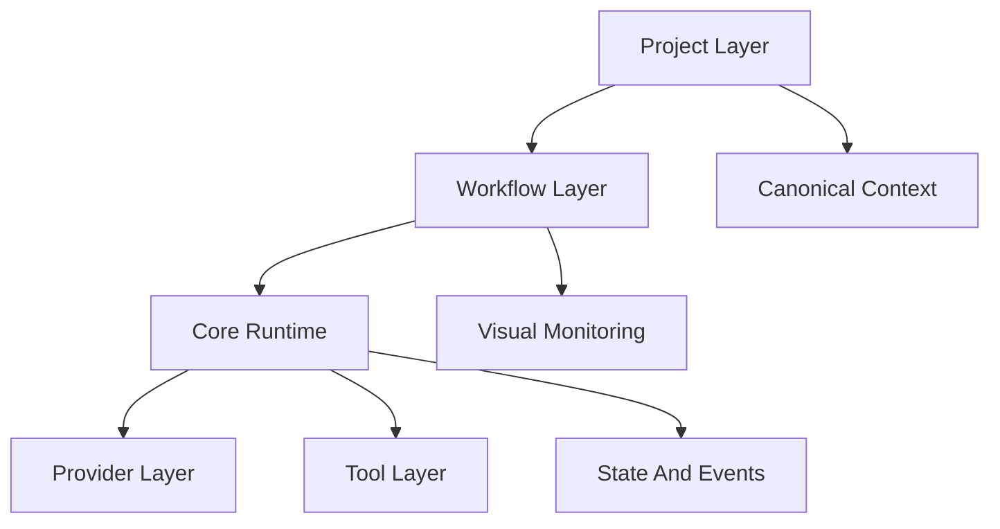
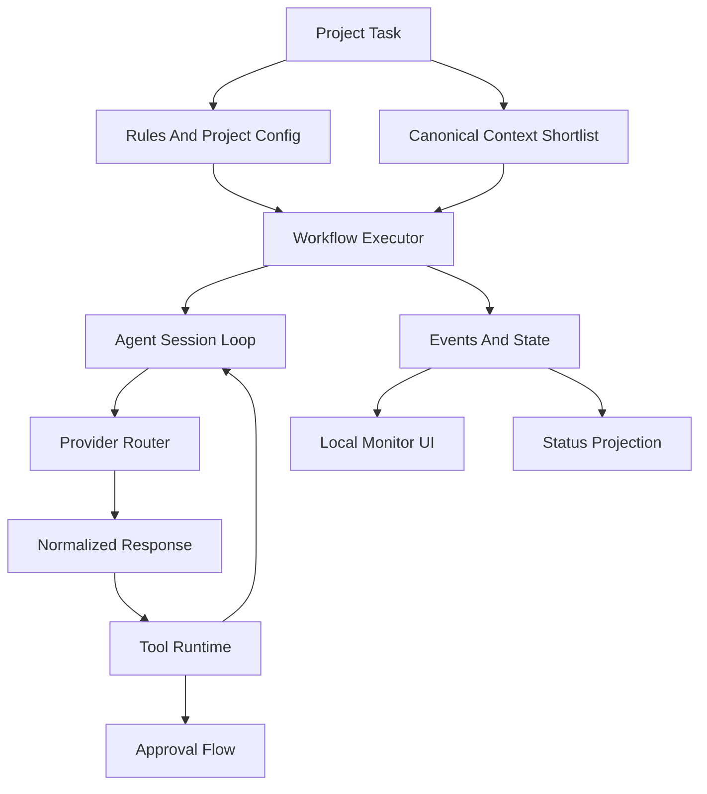

# Архитектура локальной AI-agent platform для `ai-multi-agents`

## Цель документа

Зафиксировать целевую архитектуру не просто собственного `agent core`, а полной локальной AI-agent platform, где:

- есть собственный runtime;
- есть workflow engine;
- есть project-aware слой с `rules/*` и `context/*`;
- есть визуализация и local storage;
- есть token/cost governance;
- есть динамически расширяемые agents и workflows.

## Главный тезис

Будущее проекта не в том, чтобы остаться только надстройкой над чужим агентом, и не в том, чтобы в лоб делать еще один универсальный `claude-code`.

Правильная форма для проекта:

- **собственный runtime substrate снизу**;
- **workflow engine посередине**;
- **project-aware policy and knowledge layer сверху**.

Именно это даст контроль над исполнением, не уничтожая вашу сильную сторону как knowledge-aware workflow system.

## Текущее положение дел

Сейчас `ai-multi-agents` уже силен как process and knowledge system:

- `templates/cursor/.cursor/rules/system/main/runtime-cli.mdc` задает transport к внешнему CLI;
- `orchestrator-duties.mdc` и `orchestrator-stage-*.mdc` описывают orchestration semantics;
- `tools/runtime/*` дает local state, events и status projection;
- `tools/knowledge_refresh/*` дает shortlist и derived retrieval слой;
- `rules/*` и `context/*` уже работают как мощный project-aware слой.

Проблема в том, что вычислительное ядро и значимая machine logic находятся вне полного кодового контроля.

## Три слоя целевой системы



### 1. `core runtime`

Это нижний исполняющий слой. Его задача не знать особенности проекта, а стабильно исполнять агентный цикл.

Внутри него должны жить:

- provider abstraction;
- transport normalization;
- session loop;
- streaming reducer;
- tool runtime;
- permissions and approvals;
- retries and recovery;
- token/cost accounting;
- runtime hooks в state/events.

### 2. `workflow layer`

Это средний слой, который превращает runtime в систему AI-агентов, а не просто в одного агента с тулзами.

Внутри него должны жить:

- workflow graph;
- stage graph;
- task graph;
- machine-readable orchestration;
- blocked/resume semantics;
- escalation points;
- artifact lifecycle;
- compatibility bridge со старым pipeline;
- UI-friendly execution model.

### 3. `project layer`

Это верхний слой, где проявляется ваша текущая сильная сторона.

Внутри него должны жить:

- `rules/*` как policy layer;
- `context/*` как canonical source of truth;
- project-specific workflows;
- project-specific agents;
- project config;
- project memory conventions;
- project review conventions.

## Что происходит с `orchestrator*.md`

Это ключевой момент.

Неправильный путь:

- оставить всю orchestration logic в markdown;
- или наоборот унести весь смысл и policy в код.

Правильный путь:

### В код runtime/workflow должны переехать

- transitions;
- retry rules;
- pause/resume;
- blocked reasons;
- routing между агентами;
- lifecycle events;
- stage machine;
- artifact checkpoints;
- machine-readable execution constraints.

### В `rules/*` должны остаться

- роли агентов;
- поведенческие инструкции;
- инженерная дисциплина;
- review expectations;
- project-specific constraints;
- policy semantics.

То есть:

- `workflow/runtime` отвечает за **что, когда и по каким переходам исполняется**;
- `rules/*` отвечают за **как агент должен действовать в своей роли**.

## Как эта архитектура отвечает цели проекта

### Визуализация

Визуализация должна быть не "опциональной надстройкой позже", а прямым следствием event/state модели.

UI должен питаться из:

- runtime events;
- workflow state;
- snapshots;
- usage/cost telemetry;
- blocked and approval states.

### Локальное хранение

Хранить локально нужно:

- `run_state`;
- event log;
- snapshots;
- episodic summaries;
- usage/cost traces;
- workflow definitions;
- project config cache, если он нужен.

Важное ограничение:

это хранилище не заменяет `context/*`, а работает рядом с ним.

### Минимизация token cost

Token cost должен быть заложен в саму архитектуру:

- shortlist вместо полного `context/*`;
- compaction вместо бесконечного history;
- usage normalization;
- budget thresholds;
- routing по capabilities и cost;
- локальные episodic summaries вместо сырых логов.

### Динамически пополняемые agents и workflows

Платформа должна поддерживать:

- регистрацию новых agents;
- регистрацию новых workflows;
- project-specific overrides;
- безопасное расширение без переписывания runtime core.

Именно workflow layer делает эту задачу решаемой архитектурно.

## Что берем из референсов

### Из `claude-code`

- явный loop и state machine;
- зрелый tool runtime;
- permission/safety слой;
- compaction;
- streaming semantics;
- recovery discipline.

### Из `opencode`

- provider abstraction;
- session/runtime model;
- typed state/events;
- extensibility boundaries;
- transport normalization;
- execution model, пригодную для UI.

### Что НЕ нужно копировать буквально

- vendor-specific монолитные API-слои;
- framework-specific архитектуру ради самой архитектуры;
- продуктовые ветки, завязанные на чужой UX;
- тяжеловесные решения, которые ломают ваш low-infra профиль.

## Предлагаемое размещение модулей

Рекомендуемая логика размещения в исходном репозитории:

```text
tools/
  agent_core/
    runtime/
    providers/
    tools/
    permissions/
    session/
    telemetry/
  workflow_engine/
    graph/
    executor/
    compatibility/
    artifacts/
  runtime/
  knowledge_refresh/
```

### Почему так

- `tools/runtime/*` уже занято state, events и monitor semantics;
- `agent_core` и `workflow_engine` логически шире и не должны раствориться в existing runtime helpers;
- `knowledge_refresh` должен остаться отдельным canonical-aware слоем;
- installer потом сможет раскладывать эти части в target repo без смешения обязанностей.

## Ключевые подсистемы

### Provider layer

Обязан быть capability-based.

Он должен отвечать на вопросы:

- есть ли streaming;
- есть ли tool calling;
- есть ли strict schema;
- как нормализовать usage;
- есть ли fallback parser path;
- какие лимиты и timeouts по умолчанию.

### Tool layer

Должен быть отдельным от провайдера и от workflow.

Минимальный контракт инструмента:

- `name`;
- `description`;
- `input_schema`;
- `side_effect_class`;
- `requires_approval`;
- `concurrency_policy`;
- `result_normalizer`.

### Session layer

Нужен для:

- message state;
- pending tools;
- retries;
- pause/resume;
- compaction;
- finish reasons;
- token budget control.

### Workflow layer

Нужен для:

- stages;
- tasks;
- transitions;
- barriers;
- blocked/review conditions;
- agent routing;
- artifact lifecycle.

### State and events layer

Нужен для:

- machine-readable execution trace;
- snapshots;
- status projection;
- UI feeds;
- debug bundle;
- resume.

### Context and memory layer

Нельзя смешивать:

1. `canonical project memory`  
   Это `context/*`.

2. `retrieval memory`  
   Shortlist, index, ranking.

3. `episodic runtime memory`  
   Summary-first episodes.

4. `working session memory`  
   Active context окна выполнения.

5. `procedural memory`  
   Policy, rules, workflow behavior.

Главное правило:

`context/*` всегда остается главным источником правды о проекте.

## Целевой поток исполнения



## Архитектурные приоритеты

Приоритеты должны быть именно такими:

1. `local-first state and events`
2. `visual observability`
3. `provider abstraction`
4. `tool runtime and safety`
5. `token/cost minimization`
6. `workflow engine`
7. `project-configurable agents and workflows`
8. `compatibility and rollout`

Это важнее, чем ранняя гонка за "самым мощным универсальным agent runtime".

## Риски

### Риск 1. Сделать просто свою обертку над провайдером

Итог: вы потратите силы, но не получите platform moat.

### Риск 2. Слишком рано переписать все `rules/*`

Итог: потеряете сильную сторону проекта как policy-first system.

### Риск 3. Смешать workflow layer и project layer

Итог: конфигурация под проект станет хрупкой и нерасширяемой.

### Риск 4. Оставить token/cost governance "на потом"

Итог: система будет функциональной, но неоперабельной по стоимости.

### Риск 5. Сделать UI вторичным

Итог: многоагентная платформа будет трудной для отладки и операционного использования.

## Признаки правильной реализации

1. Новый provider добавляется через adapter, а не через изменение session loop.
2. Новый agent добавляется через project/workflow config, а не через переписывание ядра.
3. Новый workflow подключается как first-class сущность.
4. `context/*` используется через shortlist и не подменяется runtime memory.
5. UI строится на тех же events и state, что и debug/runtime.
6. Machine logic больше не зависит от narrative markdown.
7. Внешний CLI со временем становится fallback, а не вычислительным ядром.

## Итоговое решение

Целевая архитектура для проекта должна быть такой:

- `core runtime` как исполнительный substrate;
- `workflow layer` как engine AI-агентов;
- `project layer` как knowledge-aware и policy-aware настройка под репозиторий.

Это лучший путь для проекта, потому что он:

- сохраняет ваши реальные преимущества;
- убирает критическую зависимость от чужого runtime;
- делает визуализацию и локальное хранение частью ядра;
- позволяет системно контролировать token cost;
- дает платформе возможность расти новыми агентами и workflow без архитектурного хаоса.
