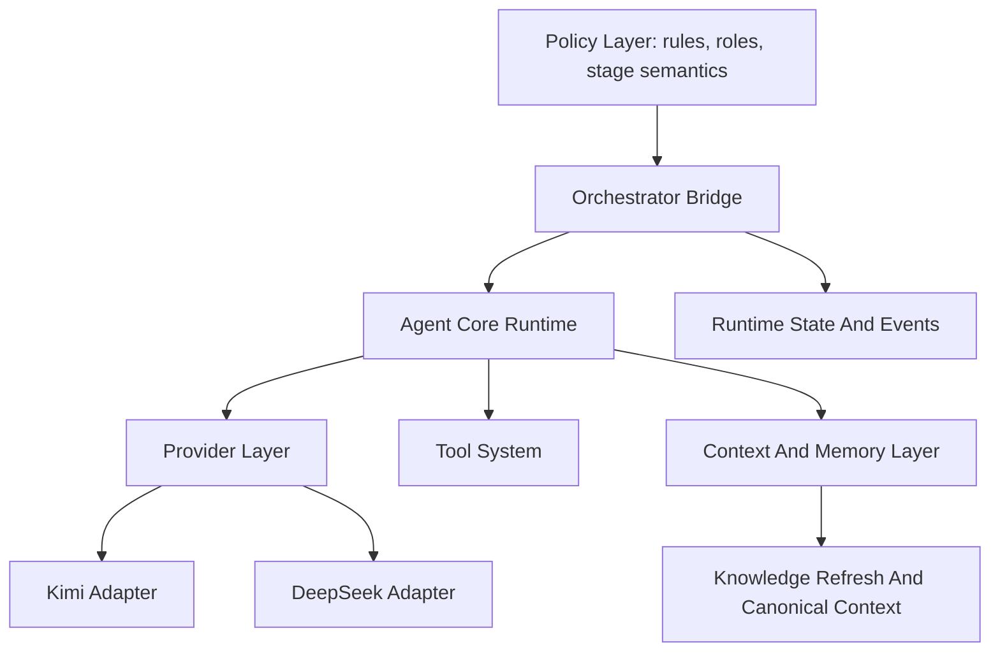
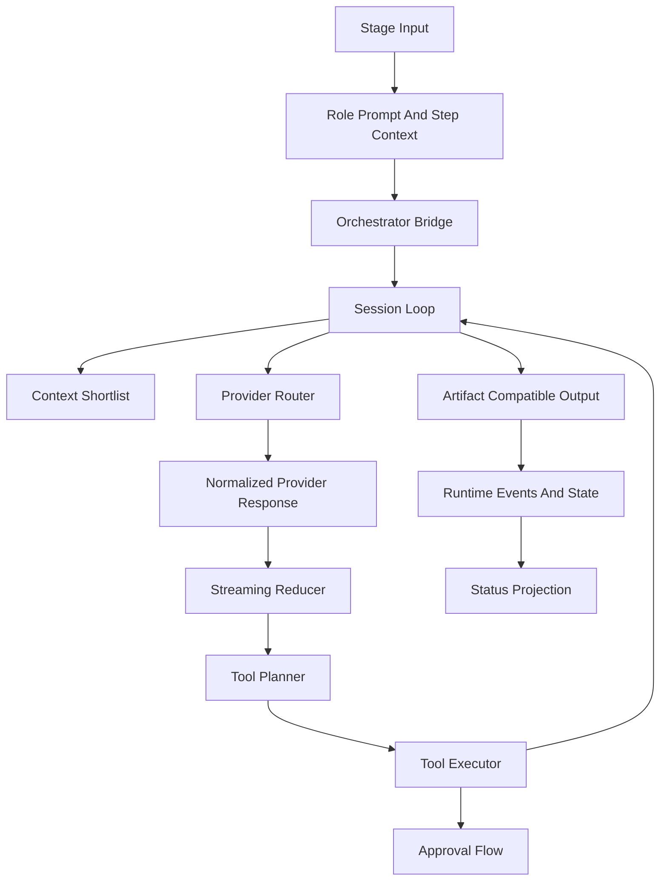

# Архитектура собственного Agent Core для `ai-multi-agents`

## Цель документа

Зафиксировать целевую архитектуру собственного `agent core`, который можно встроить в `ai-multi-agents` как новое вычислительное ядро без потери сильных сторон текущей системы.

## Текущее положение дел

Сейчас `ai-multi-agents` уже имеет зрелую оболочку вокруг исполнения, но само исполнение агентов остается внешним:

- `templates/cursor/.cursor/rules/system/main/runtime-cli.mdc` описывает запуск `agent` или `claude`;
- `templates/cursor/.cursor/rules/system/main/orchestrator-duties.mdc` и `orchestrator-stage-*.mdc` держат orchestration semantics в markdown;
- `tools/runtime/*` отвечает за event/state/status/snapshots;
- `tools/knowledge_refresh/*` отвечает за canonical knowledge shortlist и derived retrieval слой.

Проблема не в отсутствии архитектуры, а в том, что главное runtime-ядро находится вне репозитория и вне полного кодового контроля.

## Основные выводы из референсов

### Что берем из `claude-code`

1. Один явный runtime loop с детерминированным `state`.
2. Строгий инструментальный контракт вместо "модель сама разберется".
3. Разделение provider layer, tool executor и permission layer.
4. Централизованный streaming reducer.
5. Context compaction как кодовая политика.
6. Явные retry/stop reasons.

### Что берем из `opencode`

1. Provider abstraction поверх единого transport shape.
2. Session processor как центральную точку исполнения.
3. Typed event/state модель.
4. Approval flow как отдельную асинхронную подсистему.
5. Addon boundaries и extensibility.
6. Snapshot-first observability.

### Что сохраняем из `ai-multi-agents`

1. `rules/*` как policy layer.
2. `context/*` как canonical project memory.
3. `tools/runtime/*` как local-first observability/runtime state foundation.
4. `tools/knowledge_refresh/*` как canonical-aware shortlist/retrieval helper.
5. Installer-first раскладку и low-infra deployment.

## Главный архитектурный тезис

Новый `agent core` не должен заменять всю систему. Он должен стать кодовым execution layer под уже сильной оболочкой `ai-multi-agents`.

Итоговая модель:

- `rules/*` задают policy и role semantics;
- `agent core` исполняет LLM loop, tools, permissions, streaming и provider integration;
- `tools/runtime/*` держит run state, events, snapshots и status projection;
- `tools/knowledge_refresh/*` подает компактный canonical context;
- orchestration постепенно переезжает из markdown-only в hybrid, а затем в code-first runtime.

## Целевые архитектурные слои



### 1. Policy Layer

Состав:

- `templates/cursor/.cursor/agents/*.md`
- `templates/cursor/.cursor/rules/system/**/*.mdc`
- project-specific rules

Роль слоя:

- описывает, какие роли существуют;
- задает policy и человечески читаемую дисциплину;
- определяет этапы, review expectations и knowledge semantics.

Чего здесь не должно быть в целевой архитектуре:

- provider-specific transport logic;
- детерминированная machine execution logic как единственный источник истины;
- скрытые runtime-invariants, которые невозможно проверить кодом.

### 2. Orchestrator Bridge

Это переходный и затем постоянный слой совместимости между policy и новым ядром.

Он отвечает за:

- сбор `role prompt + step input`;
- выбор runtime mode;
- передачу task/stage metadata;
- публикацию runtime lifecycle hooks;
- адаптацию результата под artifact contracts.

Ключевой принцип:

`Orchestrator Bridge` сначала должен быть совместим с текущими `runtime-cli.mdc` и artifact contracts, а уже затем брать на себя часть orchestration semantics.

### 3. Agent Core Runtime

Это новое кодовое ядро.

Состав:

- session loop;
- streaming reducer;
- tool orchestration;
- permission/approval manager;
- context budget manager;
- provider router;
- retry/recovery logic.

Его инварианты:

1. Работает без привязки к одному SDK.
2. Не читает весь `context/*` без shortlist.
3. Не исполняет destructive tools без политики.
4. Публикует runtime events в совместимом формате.
5. Может быть протестирован на mock-provider без реального LLM.

### 4. Provider Layer

Provider layer должен быть capability-based.

Вместо вопроса "это Kimi или DeepSeek?" слой должен отвечать на вопрос:

- поддерживает ли провайдер streaming;
- поддерживает ли tool calling;
- умеет ли strict schema;
- как нормализуются usage/cost;
- какой parsing fallback нужен.

Рекомендуемая внутренняя структура:

- `provider/base.py` или эквивалентный модуль интерфейсов;
- `provider/transport.py`;
- `provider/normalization.py`;
- `provider/kimi.py`;
- `provider/deepseek.py`;
- `provider/router.py`.

### 5. Tool System

Tool system должен быть отдельной подсистемой, а не частью provider logic.

Минимальный состав контракта инструмента:

- `name`;
- `description`;
- `input_schema`;
- `read_only`;
- `destructive`;
- `concurrency_safe`;
- `requires_approval`;
- `result_normalizer`.

Ключевые решения:

- tool execution и approval разделены;
- batch execution допускается только для concurrency-safe tools;
- результат инструмента должен приводиться к стабильному внутреннему формату;
- side-effect class должен быть известен до вызова модели.

### 6. Context And Memory Layer

Здесь нельзя смешивать project knowledge и runtime memory.

Нужно разделить:

1. `canonical project memory`  
   Это `context/*`. Источник правды.

2. `retrieval memory`  
   Derived hints, shortlist, ranking, локальный индекс.

3. `episodic runtime memory`  
   Summary-first эпизоды выполнения: retries, blocked states, successful resolutions.

4. `working session memory`  
   Текущее окно сообщений, summaries и active context.

5. `procedural memory`  
   Правила, role policies, orchestration hints.

Главный запрет:

`working session memory` и `episodic runtime memory` не должны становиться "альтернативным источником правды" вместо `context/*`.

### 7. Runtime State And Events

`tools/runtime/*` уже задает сильную основу. Ее нужно сохранить и расширить, а не заменить.

Слой должен продолжать держать:

- `run identity`;
- `stage/task/agent lifecycle`;
- `run_state.json`;
- event log;
- snapshots;
- `status.md` как human-readable projection.

Новый `agent core` обязан публиковать совместимые lifecycle events, иначе существующий observability слой потеряет ценность.

## Предлагаемое размещение в `ai-multi-agents`

Рекомендуемая раскладка исходников:

```text
tools/
  agent_core/
    __init__.py
    session/
    providers/
    tools/
    permissions/
    context/
    bridge/
    config/
```

Причина такого placement:

- `tools/runtime/*` уже перегружен runtime-state и monitor semantics;
- `agent core` логически шире runtime observability;
- отдельный пакет проще устанавливать в целевой проект как `context/tools/agent_core/`;
- installer можно расширить без смешения `agent core` и `knowledge_refresh`.

### Что остается на старом месте

- `tools/runtime/*` остается runtime state/observability/helper layer;
- `tools/knowledge_refresh/*` остается canonical-aware retrieval/helper layer;
- `templates/*` остается policy/template source tree;
- `scripts/install-multiagent.sh` расширяется для установки `agent_core`.

## Целевой поток исполнения



## Ключевые интерфейсы

### Provider interface

Минимальные методы:

- `complete(messages, config) -> response`
- `stream(messages, config) -> iterator[event]`
- `normalize_tool_calls(response) -> list[ToolCall]`
- `normalize_usage(response) -> UsageInfo`
- `supports(capability) -> bool`

### Tool interface

Минимальные методы и данные:

- `describe() -> ToolSpec`
- `validate_input(payload) -> ToolInput`
- `execute(input, context) -> ToolResult`
- `approval_policy() -> ApprovalPolicy`

### Session interface

Минимальная модель:

- `SessionState`
- `LoopStepResult`
- `PauseReason`
- `TerminalReason`
- `CompactionPolicy`

### Bridge interface

Минимальный вход:

- role file;
- step input;
- repo root;
- selected provider/model;
- stage/task metadata;
- policy flags.

Минимальный выход:

- artifact-compatible text;
- normalized runtime metadata;
- usage info;
- lifecycle events.

## Что переносить не нужно

### Не переносить из `claude-code` один в один

- тяжелые vendor-specific ветки API;
- монолитный объект контекста со слишком большим числом обязанностей;
- продуктово-специфичный UI/runtime код.

### Не переносить из `opencode` один в один

- сильную зависимость на конкретный effect/runtime framework;
- двойную event bus модель без явной необходимости;
- эвристику выбора patch/edit по строке имени модели.

## Архитектурные принципы реализации

1. Сначала совместимость, потом полная нативность.
2. Сначала capability contract, потом конкретные adapters.
3. Сначала safety, потом агрессивный autonomy.
4. Сначала shortlist и compaction, потом большие context windows.
5. Сначала typed state/events, потом UI и optimization.
6. Сначала summary-first episodic memory, потом advanced retrieval.

## Риски и как их нейтрализовать

### Риск 1. Повторить логику внешнего CLI, но не выиграть в контроле

Снижение риска:

- начинать не с обертки над shell, а с собственного provider layer;
- тестировать session loop отдельно от orchestrator bridge.

### Риск 2. Смешать `context/*` и runtime memory

Снижение риска:

- явно запретить записи agent core в canonical docs вне writer/update pipeline;
- сделать memory boundaries кодовыми и документированными.

### Риск 3. Потерять совместимость с текущим pipeline

Снижение риска:

- держать artifact-compatible adapter;
- сохранять hybrid режим до завершения rollout.

### Риск 4. Слишком рано перенести всю orchestration semantics в код

Снижение риска:

- сначала формализовать machine-readable stage graph;
- оставить `rules/*` как policy layer и источник narrative semantics.

## Признаки, что архитектура реализована правильно

1. Новый провайдер подключается через новый adapter, а не через переписывание session loop.
2. Новый инструмент добавляется через tool contract, а не через prompt hacks.
3. Kimi и DeepSeek дают единый внутренний формат tool calls и usage.
4. `ai-multi-agents` может вызывать новый runtime без обязательного Cursor/Claude CLI.
5. `status.md`, event log и snapshots продолжают быть согласованными.
6. `context/*` остается canonical source of truth.

## Итоговое решение

Целевая архитектура для `ai-multi-agents` должна быть гибридной:

- policy-first снаружи;
- code-first внутри runtime;
- canonical-first для knowledge;
- capability-first для provider layer;
- event-first для observability;
- gradual-first для migration и rollout.

Именно такая форма позволяет забрать лучшие практики из `claude-code` и `opencode`, не потеряв сильные стороны текущего `ai-multi-agents`.
