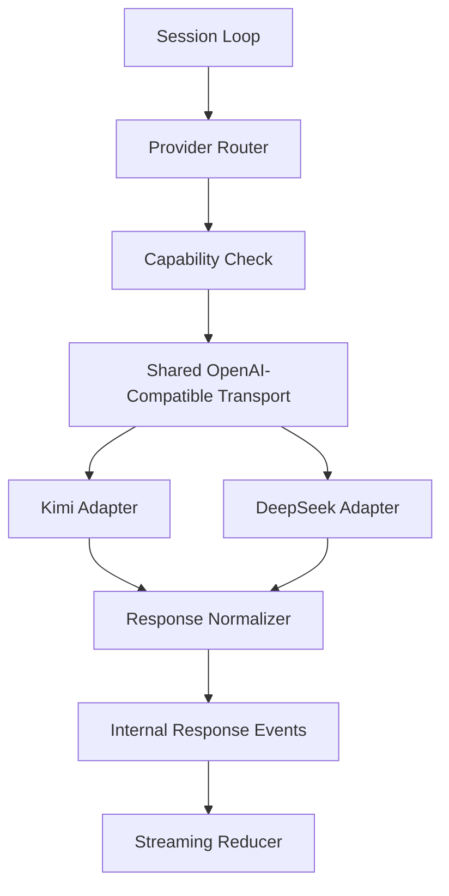

# Стратегия подключения Kimi K2 и DeepSeek к собственному Agent Core

## Цель

Описать провайдерную стратегию для нового `agent core`, в которой:

- первым штатным провайдером становится `Kimi K2`;
- вторым штатным провайдером становится `DeepSeek`;
- оба провайдера работают через единый capability-based adapter layer;
- дальнейшее подключение новых OpenAI-compatible моделей не требует переписывания runtime loop.

## Почему стратегия должна быть отдельным документом

Для `ai-multi-agents` провайдерный слой нельзя считать мелкой технической деталью. Сейчас transport жестко описывается через внешний CLI. После перехода на собственное ядро именно provider layer станет новой точкой:

- vendor lock-in или vendor neutrality;
- стабильности tool calling;
- качества streaming;
- предсказуемости cost/usage;
- future routing и fallback.

## Базовые принципы

1. Использовать общий внутренний message/tool contract.
2. Держать transport OpenAI-compatible там, где это возможно.
3. Все vendor-specific особенности замыкать внутри adapter layer.
4. Выбирать провайдера по capability profile, а не по имени модели в business logic.
5. Поддерживать parser fallback только как контролируемый резервный путь.

## Почему `Kimi K2` первым

`Kimi K2` подходит как первый провайдер по следующим причинам:

1. Поддерживает tool calling и streaming в форме, близкой к OpenAI-compatible workflow.
2. Подходит для агентных сценариев, где модель должна многократно вызывать инструменты.
3. Имеет понятный fallback path для ручного parsing tool calls, что полезно на раннем rollout.
4. Хорошо ложится на стратегию "сначала transport и tools, потом advanced routing".

При этом важно не зашивать Kimi-специфику в session loop.

## Почему `DeepSeek` вторым

`DeepSeek` удобен как второй штатный провайдер, потому что:

1. Имеет OpenAI-compatible API модель интеграции.
2. Поддерживает function/tool calling.
3. Имеет `strict` mode, полезный для schema-driven tool execution.
4. Хорошо подходит как cross-provider проверка того, что ваш `agent core` действительно vendor-neutral.

## Capability matrix

Ниже приведена не маркетинговая, а архитектурная матрица возможностей.

| Capability | Kimi K2 | DeepSeek | Требование к agent core |
|---|---|---|---|
| Chat completions style API | Да | Да | Держать общий transport layer |
| Streaming | Да | Да | Нужен единый streaming reducer |
| Tool / function calling | Да | Да | Нужен единый internal tool call format |
| Provider-specific parsing особенности | Да | Да | Нужен normalization layer |
| Strict schema path | Ограниченно / зависит от runtime | Да | Нужен capability flag |
| Parser fallback | Да, особенно полезен для raw path | Возможен, но менее центральный | Нужен резервный parser layer |
| Usage normalization | Нужно нормализовать | Нужно нормализовать | Нужен общий usage contract |
| Timeout / retry policy | Нужна | Нужна | Нужен общий recovery policy |

## Целевой provider stack

## Что должно быть общим для всех провайдеров

### Общий request shape

Внутренний runtime должен собирать единый request object:

- `messages`;
- `tools`;
- `tool_choice`;
- `temperature`;
- `max_output_tokens`;
- `stream`;
- `provider_hints`;
- `timeout_policy`.

### Общий response shape

Нужно нормализовать:

- text content;
- reasoning или аналогичные промежуточные данные;
- tool calls;
- finish reason;
- usage;
- provider diagnostics.

### Общая модель tool call

Внутренний формат должен хранить:

- `call_id`;
- `tool_name`;
- `arguments_json`;
- `stream_index`;
- `provider_name`;
- `is_complete`.

Это позволит одинаково собирать tool calls и из полноценных ответов, и из stream chunks.

## Provider-specific responsibilities

### Kimi adapter

Должен отвечать за:

- стандартный chat-completions вызов;
- сбор streaming tool call chunks;
- parser fallback для raw tool-call section path;
- нормализацию finish reasons;
- нормализацию usage.

Kimi adapter не должен:

- самостоятельно исполнять инструменты;
- решать approval/policy;
- менять global session semantics.

### DeepSeek adapter

Должен отвечать за:

- стандартный function calling path;
- поддержку `strict` mode там, где schema этого требует;
- нормализацию response/tool/usage;
- обработку beta-path для strict schema, если используется.

DeepSeek adapter не должен:

- дублировать tool contract;
- определять orchestration поведение;
- внедрять отдельный session loop.

## Стратегия конфигурации

Рекомендуемая конфигурационная модель:

1. `default_provider = kimi`
2. `fallback_provider = deepseek`
3. `provider_capabilities` задаются явно
4. `model_profile` хранит:
   - provider name;
   - model id;
   - supports_streaming;
   - supports_tools;
   - supports_strict_schema;
   - timeout defaults;
   - retry defaults.

Ключевой принцип:

`model_profile` не должен жить в нескольких несогласованных местах одновременно.

## Стратегия маршрутизации

На первом этапе routing должен быть простым и предсказуемым.

### Этап 1. Явный выбор провайдера

- пользователь или конфиг проекта выбирает Kimi либо DeepSeek;
- runtime не пытается динамически "умничать".

### Этап 2. Capability-aware fallback

- если провайдер не поддерживает нужную capability, выбирается fallback;
- fallback определяется до вызова модели, а не после хаотичной ошибки.

### Этап 3. Governance-aware routing

- использовать cost/usage/budget signals;
- использовать reliability score;
- использовать task class, если это даст реальную пользу.

До прохождения первых двух этапов advanced routing включать не стоит.

## Стратегия strict schema

Strict schema особенно важна для write/destructive tools и для артефактов с жестким форматом.

Рекомендуемое правило:

1. Если провайдер поддерживает строгую схему стабильно, использовать strict path для критичных tool-ов.
2. Если strict path недоступен, использовать обычную schema validation + retry policy.
3. Если schema нарушена дважды, не продолжать молча, а переходить в controlled failure path.

## Parser fallback strategy

Fallback нужен, но только как резерв:

1. основной путь: нормальный tool/function calling API;
2. резервный путь: parser fallback на сырой ответ;
3. аварийный путь: controlled failure с логированием и эскалацией.

Почему нельзя строить систему на fallback:

- это повышает хрупкость;
- переносит сложность в текстовый parsing;
- ухудшает воспроизводимость.

Но для Kimi наличие fallback полезно как страховка раннего запуска.

## Нормализация usage и telemetry

Каждый adapter должен приводить usage к единой модели:

- input tokens;
- output tokens;
- reasoning tokens, если доступны;
- cached tokens, если доступны;
- estimated cost;
- provider metadata.

Наружу runtime должны выходить только нормализованные поля. Vendor-specific сырые данные можно хранить только в debug payload.

## Порядок внедрения

### Фаза 1. Shared transport и mock provider

**Цель**

Проверить контракт без реального вендора.

**Критерии приемки**

- mock provider проходит session loop и tools;
- transport и normalization отделены от runtime.

**Тесты**

- contract tests;
- streaming assembly tests;
- usage normalization tests.

### Фаза 2. `Kimi K2` как основной provider

**Цель**

Подключить первый реальный провайдер без архитектурного долга.

**Критерии приемки**

- Kimi выполняет tool calling и streaming path;
- parser fallback реализован, но не является основным путем;
- runtime loop не содержит Kimi-specific ветвлений.

**Тесты**

- live smoke test;
- tool calling test;
- streaming tool chunks test;
- fallback parser test.

### Фаза 3. `DeepSeek` как второй provider

**Цель**

Подтвердить vendor-neutrality ядра.

**Критерии приемки**

- DeepSeek работает через тот же transport contract;
- strict schema path проверен;
- provider switch не требует изменения tools и session loop.

**Тесты**

- live smoke test;
- strict schema test;
- provider switch regression test.

### Фаза 4. Routing и fallback

**Цель**

Сделать multi-provider режим эксплуатационно полезным.

**Критерии приемки**

- fallback работает предсказуемо;
- usage/cost telemetry пригодна для выбора маршрута;
- failures одного провайдера не ломают весь runtime бесконтрольно.

**Тесты**

- fallback drill;
- timeout retry test;
- budget-aware routing simulation.

## Что нельзя делать

1. Нельзя зашивать имя модели в tool executor.
2. Нельзя делать отдельный session loop под Kimi и отдельный под DeepSeek.
3. Нельзя смешивать provider normalization и business logic.
4. Нельзя делать parser fallback основным путем.
5. Нельзя полагаться на "модель сама будет всегда соблюдать схему".

## Минимальный чеклист готовности provider layer

Provider layer считается зрелым, если:

1. новый provider подключается через новый adapter;
2. tools работают через единый contract;
3. usage нормализуется в общий вид;
4. stream events проходят через общий reducer;
5. strict/fallback поддерживаются как capability, а не как хаки в session loop;
6. failure paths диагностируемы и покрыты тестами.

## Итоговая рекомендация

Оптимальная стратегия для `ai-multi-agents`:

1. сначала реализовать shared provider layer и mock provider;
2. затем подключить `Kimi K2` как основной провайдер;
3. потом подключить `DeepSeek` как второй провайдер и валидатор vendor-neutrality;
4. только после этого добавлять routing, cost governance и advanced fallback.

Такой порядок даст реальный контроль над execution layer и не повторит главную слабость текущей схемы: зависимость от внешнего CLI вместо собственного управляемого runtime.
