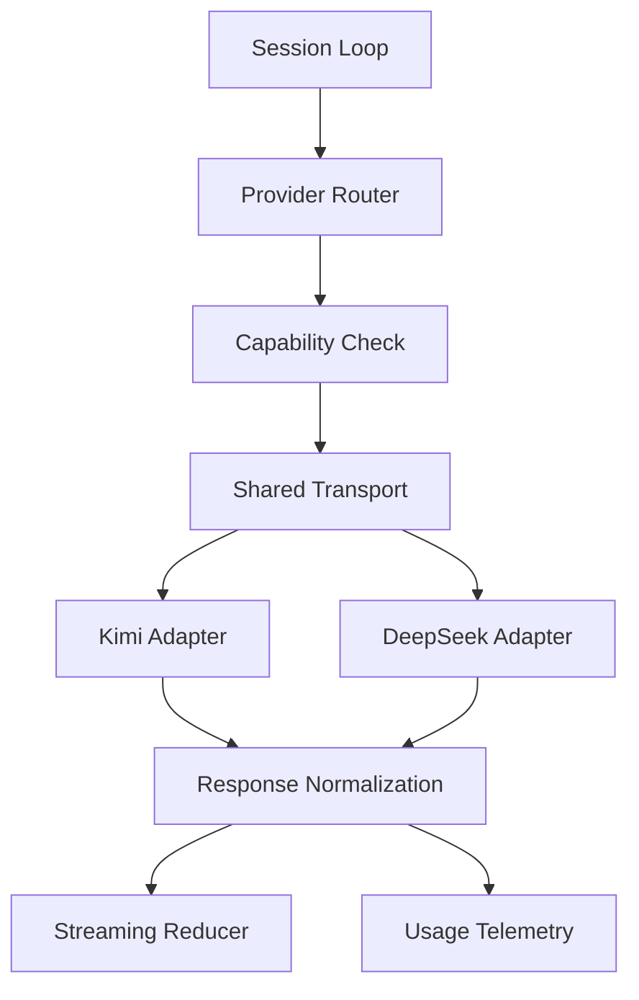

# Стратегия провайдеров для `core runtime`: Kimi K2, DeepSeek и следующие модели

## Цель документа

Зафиксировать, как provider layer должен работать внутри будущего `core runtime`, чтобы:

- `Kimi K2` стал первым штатным провайдером;
- `DeepSeek` стал вторым штатным провайдером;
- future providers подключались через те же контракты;
- token cost, reliability и capabilities учитывались системно;
- provider layer был частью платформы, а не ее центром.

## Роль provider layer в общей платформе

Provider layer отвечает только за доступ к моделям и нормализацию ответов. Он не должен подменять собой:

- workflow engine;
- tool runtime;
- project layer;
- policy layer;
- visual monitoring;
- local state store.

Это важно, потому что целевая система выигрывает не за счет "особенного доступа к модели", а за счет сочетания:

- local runtime;
- workflow execution;
- canonical context;
- observability;
- token governance;
- project configurability.

## Базовые принципы

1. Провайдер выбирается по capabilities, а не по бренду.
2. Внутренний runtime использует единый message/tool contract.
3. Все vendor-specific особенности остаются внутри adapter layer.
4. Parser fallback допустим только как резерв.
5. Usage/cost normalization обязательна.
6. Provider logic не должна протекать в workflow или project layer.

## Почему сначала `Kimi K2`

`Kimi K2` разумно брать первым, потому что:

1. он подходит для агентных tool-calling сценариев;
2. у него есть streaming path;
3. у него есть fallback path для ручного разбора tool calls;
4. он хорошо подходит для раннего вывода собственного runtime из зависимости на Cursor/Claude Code.

Но важно: `Kimi K2` не должен становиться архитектурным центром системы.

## Почему затем `DeepSeek`

`DeepSeek` нужен не только как запасной провайдер, но и как архитектурный тест на vendor-neutrality.

Он полезен потому что:

1. поддерживает OpenAI-compatible integration style;
2. поддерживает function/tool calling;
3. поддерживает strict schema path;
4. позволяет проверить, что runtime не зашит под Kimi.

## Что должно уметь provider layer

### Обязательные capabilities

- chat completion style requests;
- streaming;
- tool or function calling;
- finish reason normalization;
- usage normalization;
- timeout and retry metadata;
- capability discovery;
- provider diagnostics.

### Желательные capabilities

- strict schema support;
- parser fallback support;
- richer reasoning metadata;
- cache-related telemetry, если доступно.

## Capability matrix

| Capability | Kimi K2 | DeepSeek | Что должен делать runtime |
|---|---|---|---|
| Streaming | Да | Да | Использовать единый streaming reducer |
| Tool calling | Да | Да | Нормализовать в единый ToolCall формат |
| Strict schema | Ограниченно | Да | Включать через capability flag |
| Parser fallback | Да | Возможен | Держать как резервный путь |
| Usage normalization | Нужно | Нужно | Собирать в общий telemetry contract |
| Timeout metadata | Нужно | Нужно | Поддерживать общую recovery policy |
| Provider-specific quirks | Есть | Есть | Изолировать в adapters |

## Место provider layer в `core runtime`

## Что должно быть общим для всех провайдеров

### Общий request contract

Внутренний runtime должен уметь собрать единый запрос:

- `messages`;
- `tools`;
- `tool_choice`;
- `temperature`;
- `max_output_tokens`;
- `stream`;
- `timeout_policy`;
- `provider_hints`.

### Общий response contract

Все провайдеры должны приводиться к виду:

- `text_parts`;
- `tool_calls`;
- `finish_reason`;
- `usage`;
- `provider_metadata`;
- `raw_debug_payload`.

### Общая модель tool call

Внутренний формат должен содержать:

- `call_id`;
- `tool_name`;
- `arguments_json`;
- `stream_index`;
- `provider_name`;
- `is_complete`.

## Ответственность adapter-ов

### Kimi adapter

Отвечает за:

- обычный completion path;
- streaming assembly;
- parser fallback;
- usage normalization;
- finish reason normalization.

Не отвечает за:

- tool execution;
- approval logic;
- workflow decisions;
- project-specific policy.

### DeepSeek adapter

Отвечает за:

- function calling path;
- strict schema path;
- usage normalization;
- finish reason normalization;
- provider quirks encapsulation.

Не отвечает за:

- orchestration;
- tool registry;
- workflow routing;
- UI behavior.

## Стратегия конфигурации

Рекомендуемая модель:

1. `default_provider = kimi`
2. `fallback_provider = deepseek`
3. `model_profiles` описывают model-level capabilities
4. `provider_policies` задают timeouts, retries и fallback rules

В `model_profile` должны жить:

- `provider_name`;
- `model_id`;
- `supports_streaming`;
- `supports_tools`;
- `supports_strict_schema`;
- `timeout_defaults`;
- `retry_defaults`;
- `cost_profile`, если доступен.

## Стратегия маршрутизации

### Фаза 1. Явный выбор

- проект выбирает Kimi или DeepSeek явно;
- runtime не делает умный routing без данных.

### Фаза 2. Capability-aware fallback

- если провайдер не поддерживает нужную capability, используется fallback;
- это делается до вызова модели.

### Фаза 3. Cost/reliability-aware routing

- routing начинает учитывать:
  - budget;
  - reliability;
  - task class;
  - schema strictness;
  - expected context size.

Важно: этот этап нельзя внедрять раньше, чем готова usage telemetry.

## Стратегия token/cost governance

Provider layer обязан отдавать данные, пригодные для cost-aware runtime.

Нужно нормализовать:

- input tokens;
- output tokens;
- reasoning tokens, если доступны;
- cached tokens, если доступны;
- estimated cost;
- provider latency;
- retry count.

Эти данные потом используются не только для статистики, но и для:

- routing;
- budget cutoffs;
- UI;
- optimization решений.

## Strict schema policy

Strict schema должна применяться:

- для write/destructive tools;
- для артефактов с жестким форматом;
- для опасных операций, где нужен высокий контроль.

Правило:

1. Если strict schema доступна, использовать ее для критичных paths.
2. Если strict schema недоступна, использовать обычную schema validation и recovery policy.
3. Если нарушение схемы повторяется, переходить в controlled failure, а не продолжать молча.

## Parser fallback policy

Fallback нужен, но он вторичен.

Порядок путей:

1. основной путь: штатный tool/function calling API;
2. резервный путь: parser fallback;
3. аварийный путь: controlled failure + logging + escalation.

Почему нельзя строить архитектуру на fallback:

- это хрупко;
- это дороже в сопровождении;
- это хуже тестируется;
- это ухудшает воспроизводимость.

## Что нельзя делать

1. Нельзя зашивать имя модели в session loop.
2. Нельзя смешивать provider normalization и business logic workflow.
3. Нельзя держать отдельный runtime path под каждого провайдера.
4. Нельзя считать provider layer заменой tool/runtime layer.
5. Нельзя откладывать usage normalization на конец проекта.

## Порядок внедрения

### Фаза 1. Shared transport и mock provider

**Критерии приемки**

- provider contract стабилен;
- mock provider проходит session loop;
- transport отделен от runtime logic.

**Тесты**

- contract tests;
- usage normalization tests;
- streaming reconstruction tests.

### Фаза 2. `Kimi K2` как первый штатный провайдер

**Критерии приемки**

- Kimi работает через общий adapter layer;
- tool calling и streaming поддержаны;
- parser fallback реализован как резерв.

**Тесты**

- Kimi smoke test;
- tool calling tests;
- streaming assembly tests;
- fallback parser tests.

### Фаза 3. `DeepSeek` как второй штатный провайдер

**Критерии приемки**

- DeepSeek подключен через тот же contract;
- strict schema path работает;
- provider switch не меняет session loop.

**Тесты**

- DeepSeek smoke test;
- strict schema tests;
- provider switch tests.

### Фаза 4. Capability and cost-aware routing

**Критерии приемки**

- routing использует telemetry и capabilities;
- fallback предсказуем;
- бюджет и надежность можно учитывать автоматически.

**Тесты**

- budget-aware routing simulations;
- fallback drills;
- timeout/retry tests.

## Признаки зрелого provider layer

1. Новый провайдер добавляется через adapter и profile.
2. Usage/cost данные одинаково собираются у разных провайдеров.
3. Streaming проходит через единый reducer.
4. Tool calls приводятся к одному формату.
5. Workflow и project layers не знают vendor-specific деталей.
6. Provider layer помогает экономить токены, а не только "отправляет запрос".

## Итоговая рекомендация

Правильная стратегия для проекта такая:

1. сначала стабилизировать shared provider layer;
2. затем подключить `Kimi K2` как первый production path;
3. затем подключить `DeepSeek` как второй production path и валидатор vendor-neutrality;
4. после этого вводить capability-aware и cost-aware routing.

Такой путь соответствует судьбе проекта как локальной AI-agent platform: провайдеры становятся важной, но подчиненной частью `core runtime`, а не новой точкой архитектурной зависимости.
