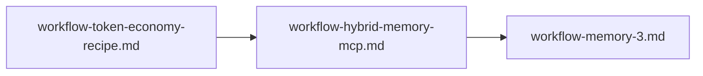

# Workflow: memory-3 (сравнительные улучшения после token-economy и hybrid memory)

Документ задаёт **третью итерацию** развития памяти и токен-экономии в `ailit`: сравнительный анализ относительно доноров, список улучшений, этапы, задачи, критерии приёмки и проверки. Этот workflow начинается **после** закрытия [`workflow-token-economy-recipe.md`](workflow-token-economy-recipe.md) и [`workflow-hybrid-memory-mcp.md`](workflow-hybrid-memory-mcp.md).

Канон процесса разработки репозитория: [`.cursor/rules/project-workflow.mdc`](../.cursor/rules/project-workflow.mdc).  
Предыдущие workflow: [`workflow-token-economy-recipe.md`](workflow-token-economy-recipe.md), [`workflow-hybrid-memory-mcp.md`](workflow-hybrid-memory-mcp.md).

## Статус предусловий (перед стартом M3)

Этот workflow начинается после закрытия двух предыдущих. На текущем состоянии репозитория:

- `workflow-token-economy-recipe.md`: постановка TE‑0…TE‑5 закрыта в документе, runtime‑механизмы pager/budget/prune реализованы (см. историю коммитов вокруг `W-TE-*`).
- `workflow-hybrid-memory-mcp.md`: H0…H4 закрыты в документе; в коде реализован local‑first KB scaffold (SQLite) и инструменты `kb_*` для `ailit chat`; наблюдаемость `memory.access` и редактирование аргументов памяти в JSONL включены.

Важно: M3 всё равно требуется как следующий слой — governance, multi-layer memory, orchestration и evaluation. То есть наличие SQLite‑scaffold **не** означает, что M3 можно пропустить.

## Доноры: уточнённые ссылки на best practices (для “киллер‑фич” M3)

Этот раздел фиксирует **конкретные файлы и диапазоны строк** в донорах, которые нужно использовать как ориентиры (без копипаста). Он дополняет ссылки из §1–§2.

### Claude Code (`/home/artem/reps/claude-code`)

- **Post-compact restore “read file state”**: после компактации подмешиваются “recently accessed files” в пределах токен-бюджета, чтобы модель не перечитывала файлы заново.

```1398:1449:/home/artem/reps/claude-code/services/compact/compact.ts
Creates attachment messages for recently accessed files to restore them after compaction.
...
Files are selected based on recency, but constrained by both file count and token budget limits.
```

- **Сборка system prompts по приоритетам** (слои override/coordinator/agent/custom/default).

```28:74:/home/artem/reps/claude-code/utils/systemPrompt.ts
Builds the effective system prompt array based on priority:
0. Override ...
1. Coordinator ...
2. Agent ...
3. Custom ...
4. Default ...
```

- **Range read + метрики чтения**: чтение текста через `readFileInRange` с offset/limit и логированием `readLines/readBytes`.

```1019:1055:/home/artem/reps/claude-code/tools/FileReadTool/FileReadTool.ts
// Text file (single async read via readFileInRange) ...
logEvent(... { totalLines, readLines, totalBytes, readBytes, offset, limit })
```

### OpenCode (`/home/artem/reps/opencode`)

- **Модульные prompt-фрагменты по провайдерам** (раздельные `.txt`, чтобы не держать “простыню” в одном модуле).

```5:33:/home/artem/reps/opencode/packages/opencode/src/session/system.ts
import PROMPT_ANTHROPIC from \"./prompt/anthropic.txt\"
...
export function provider(model: Provider.Model) { ... }
```

- **Типизированная шина событий** как ориентир для stream/UI и проверяемого event contract.

```29:40:/home/artem/reps/opencode/packages/opencode/src/bus/index.ts
publish/subscribe интерфейсы (typed events)
```

### Context-mode (`/home/artem/reps/context-mode`)

- **Unified report**: один “полный отчёт” `FullReport` (savings + continuity + DB analytics) как единый источник для stats.

```70:114:/home/artem/reps/context-mode/src/session/analytics.ts
FullReport ... savings ... continuity ... resume_ready ...
```

```229:235:/home/artem/reps/context-mode/src/session/analytics.ts
queryAll — single unified report from ONE source
This is the ONE call that ctx_stats should use.
```

### RuFlo (`/home/artem/reps/ruflo`)

- **Token governance layer** как набор отдельных компонентов (BudgetManager, ContextPackBuilder, PromptProfileRegistry, SemanticResponseCache, ToolExposurePolicy).

```34:70:/home/artem/reps/ruflo/plan/03_token_optimization.md
Нужны 5 отдельных компонента ...
```

```50:54:/home/artem/reps/ruflo/plan/03_token_optimization.md
ContextPackBuilder: index -> fetch-by-id -> full file on demand
```

### ai-multi-agents (`/home/artem/reps/ai-multi-agents`)

- **Canonical files = source of truth; DB/index = acceleration layer** (rebuildable, не истина).

```160:199:/home/artem/reps/ai-multi-agents/plans/ai-memory.md
Canonical project memory ... Derived retrieval memory ... files are source of truth, DB is acceleration layer
```

### Graphiti (`/home/artem/reps/graphiti`)

- **Temporal/provenance**: facts имеют validity window и `superseded`, всё трассируется к episodes.

```65:82:/home/artem/reps/graphiti/README.md
context graph ... validity window ... superseded ... traces back to episodes
```

### Hindsight / Letta

Ориентиры остаются как в §1.2 (learning over time / memory blocks); конкретные “киллер‑фичи” должны быть отражены в evaluation suite (M3‑5.2) и в governance (M3‑4.2).

---

## Вопросы к пользователю (если нужна постановка точнее)

Ответы зафиксированы (2026‑04‑22):

1) **Да, цель “resume after compaction” нужна.**  
   Пояснение (что именно делаем в M3):
   - **Цель**: после compaction/рестарта агент продолжает задачу без повторного “read the same files again”, если файл уже недавно читали.
   - **Механика**: держим “recently-read state” (путь → {mtime/etag, offset/limit, digest, кусок content}) и при восстановлении:
     - подмешиваем в контекст **не более N файлов** и **не более X токенов на файл**;
     - не прикладываем то, что уже присутствует в “preserved tail” (avoid double-inject).
   - **Безопасность/ограничения**: восстанавливаем только whitelist типов (например: source/config), не тащим бинарники; если `mtime` изменился — читаем свежую версию range-read’ом.
   - **Измеримость**: в отчёте должны быть метрики “post-compact restored files”, “bytes/tokens injected”, “re-read avoided”.
   - **Риск**: не допустить “восстановления мусора” — это acceleration layer, не source of truth.
2) **Нужны обе формы отчёта:**  
   - **общая команда/панель** (единый итог: savings + continuity + resume-ready);  
   - **отдельные команды/панели по подсистемам** (pager/budget/prune, tool schema, memory, compaction/resume и т.д.).  
   Это разные команды, но общий отчёт обязан агрегировать их в один результат.
3) **Квота на e2e**: ориентир — **до 5k output tokens** на тест.  
   Значит, e2e‑сценарии должны быть “короткими”: проверяем логи/счётчики и структурированные summary, избегаем full-dump вывода файлов.

## Порядок выполнения



Этот файл нужен, чтобы закрыть то, в чём `ailit` после первых двух workflow всё ещё будет слабее отдельных доноров: token governance, многослойная память, retrieval orchestration, temporal/provenance model, promotion pipeline, acceleration layer и memory governance.

---

## 0. Цель итерации

Сделать память и экономию контекста в `ailit` **сильнее и целостнее**, чем просто сумма pager + shared KB:

- усилить **governance** токенов и tool exposure;
- разделить память на **working / episodic / semantic / procedural**;
- ввести **retrieval orchestration** и **temporal/provenance** модель;
- добавить **promotion pipeline** и правила владения памятью;
- ввести **derived acceleration layer** и измеримую оценку качества retrieval/memory.

---

## 1. Сравнительный анализ относительно доноров

### 1.1. Что дадут первые два workflow

После [`workflow-token-economy-recipe.md`](workflow-token-economy-recipe.md) ожидается:

- локальная токен-экономия runtime-сессии (`pager`, `budget`, `prune`, diagnostics, benchmark);
- более дешёвые длинные сессии и меньше сырых простыней в контексте.

После [`workflow-hybrid-memory-mcp.md`](workflow-hybrid-memory-mcp.md) ожидается:

- shared KB / MCP;
- `scopes`, `provenance`, index-first retrieval;
- межсессионное и межагентное переиспользование знаний.

### 1.2. Где после этого `ailit` всё ещё слабее доноров

1. **Слабее `ruflo` по token governance**
   - У `ruflo` явно выделены `TokenBudgetManager`, `ContextPackBuilder`, `PromptProfileRegistry`, `SemanticResponseCache`, `ToolExposurePolicy`.
   - Референсы:
     - `/home/artem/reps/ruflo/plan/03_token_optimization.md`, строки `34–70`;
     - `/home/artem/reps/ruflo/plan/03_token_optimization.md`, строки `106–133`.
2. **Слабее `ai-multi-agents` по memory layering и acceleration layer**
   - У донора явно разделены `working`, `episodic`, `semantic`, `procedural`;
   - есть derived retrieval memory как ускоряющий слой, а не источник истины.
   - Референсы:
     - `/home/artem/reps/ai-multi-agents/plans/ai-memory.md`, строки `40–48`;
     - `/home/artem/reps/ai-multi-agents/plans/ai-memory.md`, строки `180–199`.
3. **Слабее `context-mode` по continuity discipline и analytics**
   - У донора continuity и savings уже сведены в единый отчёт, а sandbox/think-in-code являются обязательной практикой.
   - Референсы:
     - `/home/artem/reps/context-mode/README.md`, строки `36–40`;
     - `/home/artem/reps/context-mode/src/session/analytics.ts`, строки `74–114`.
4. **Слабее `graphiti` по temporal/provenance model**
   - У донора память нативно учитывает, что было истинно когда, и откуда взялся факт.
   - Референсы:
     - `/home/artem/reps/graphiti/README.md`, строки `42–55`;
     - `/home/artem/reps/graphiti/README.md`, строки `67–81`.
5. **Слабее `hindsight` по long-term learning**
   - У донора память не только вспоминает, но и помогает агенту учиться во времени.
   - Референс:
     - `/home/artem/reps/hindsight/README.md`, строки `20–43`.
6. **Слабее `letta` по явной модели memory blocks**
   - У донора память уже оформлена как отдельные блоки с различной ролью.
   - Референс:
     - `/home/artem/reps/letta/README.md`, строки `47–63`.

### 1.3. Какой результат должен быть лучше доноров

`ailit` должен стать **лучше в интеграции под собственный engineering workflow**, даже если не станет глубже каждого донора по отдельности:

- лучше `ruflo` и `context-mode` по приземлению в конкретный CLI/runtime и workflow разработки;
- лучше `obsidian-memory-mcp` по правилам scope / governance / acceptance, а не просто по storage;
- лучше `letta`, `hindsight`, `graphiti` по связке **workflow -> implementation -> diagnostics -> tests**, а не только по теоретической модели памяти.

---

## 2. Улучшения, которые нужно зафиксировать

### 2.1. Token governance layer

Нужно добавить как канонический следующий слой:

- `TokenBudgetManager`;
- `ContextPackBuilder`;
- `PromptProfileRegistry`;
- `SemanticResponseCache`;
- `ToolExposurePolicy`.

Основание:

- `/home/artem/reps/ruflo/plan/03_token_optimization.md`, строки `34–70`;
- `/home/artem/reps/ruflo/plan/03_token_optimization.md`, строки `117–133`.

### 2.2. Многослойная память

Нужно фиксировать 4 memory-слоя:

- `working`;
- `episodic`;
- `semantic`;
- `procedural`.

Основание:

- `/home/artem/reps/ai-multi-agents/plans/ai-memory.md`, строки `42–49`;
- `/home/artem/reps/ai-multi-agents/plans/ai-memory.md`, строки `136–152`.

### 2.3. Retrieval orchestration

Нужен не один retrieval path, а координация:

- keyword / BM25;
- embeddings;
- graph traversal;
- cost-aware ranking;
- fetch-by-id после индекса.

Основание:

- `/home/artem/reps/context-mode/README.md`, строки `36–40`;
- `/home/artem/reps/graphiti/README.md`, строки `46–55`;
- `/home/artem/reps/ruflo/plan/01_project_memory.md`, строки `33–40`, `87–91`.

### 2.4. Temporal / provenance model

Нужно явно хранить:

- `source`;
- `timestamp`;
- `supersedes`;
- validity window;
- episode / run origin.

Основание:

- `/home/artem/reps/graphiti/README.md`, строки `67–81`.

### 2.5. Promotion pipeline и governance

Нужно развести:

- `working draft`;
- `episodic record`;
- `reviewed semantic fact`;
- `promoted architectural / contract record`.

Основание:

- `/home/artem/reps/ai-multi-agents/plans/ai-memory.md`, строки `72–112`;
- `/home/artem/reps/ruflo/plan/01_project_memory.md`, строки `26–41`.

### 2.6. Derived acceleration layer

Нужно зафиксировать правило:

- markdown / canonical memory files = source of truth;
- DB / index / graph cache = acceleration layer.

Основание:

- `/home/artem/reps/ai-multi-agents/plans/ai-memory.md`, строки `180–199`.

---

## 3. Этапы работ

### Этап M3-0. Gap analysis и целевой контракт

#### Задача M3-0.1 — Свести gap matrix

**Промпт исполнителю:**  
«Собери таблицу `текущий ailit после первых двух workflow -> донор -> чего не хватает -> что внедряем в M3`. Не копируй код доноров; фиксируй только архитектурные заимствования и measurable improvements.»

**Критерии приёмки:**

- таблица покрывает `ruflo`, `context-mode`, `ai-multi-agents`, `graphiti`, `hindsight`, `letta`;
- по каждому донору указаны `лучше / хуже / что добираем`;
- нет решений без ссылки на локальный первоисточник.

**Тесты/проверки:**

- ручная сверка со ссылками из разделов `1` и `2`.

#### Задача M3-0.2 — Зафиксировать целевой MVP M3

**Промпт исполнителю:**  
«Сформулируй, какой минимальный набор улучшений обязателен для M3, а что остаётся дальнейшим развитием. Раздели на must-have и deferred.»

**Критерии приёмки:**

- есть список `must-have` и `deferred`;
- `must-have` не больше 6 крупных направлений;
- зафиксирован критерий, что считать завершением M3.

**Тесты/проверки:**

- ручная проверка, что scope итерации не расползается.

### Этап M3-1. Token governance и tool exposure

#### Задача M3-1.1 — Спроектировать governance layer

**Промпт исполнителю:**  
«Опиши для `ailit` слой token governance: `TokenBudgetManager`, `ContextPackBuilder`, `PromptProfileRegistry`, `SemanticResponseCache`, `ToolExposurePolicy`. Покажи, какие части продолжают pager/budget/prune из первого workflow, а какие являются новой надстройкой.»

**Критерии приёмки:**

- есть канонический список из 5 компонентов;
- у каждого компонента описаны входы, выходы и ответственность;
- показана связь с текущими механизмами из `workflow-token-economy-recipe.md`.

**Тесты/проверки:**

- ручная сверка с `/home/artem/reps/ruflo/plan/03_token_optimization.md`, строки `34–70`, `106–133`.

#### Задача M3-1.2 — Зафиксировать selective tool exposure

**Промпт исполнителю:**  
«Опиши ступенчатую выдачу tools в `ailit`: family index -> tool detail -> invoke. Зафиксируй, как это уменьшит стоимость prompt и как будет измеряться эффект.»

**Критерии приёмки:**

- есть контракт selective exposure;
- указаны telemetry / diagnostics для оценки экономии;
- описаны failure modes.

**Тесты/проверки:**

- ручная сверка с `ruflo` и `claude-code`.

### Этап M3-2. Multi-layer memory model

#### Задача M3-2.1 — Разделить memory-слои

**Промпт исполнителю:**  
«Переведи память `ailit` в явную модель `working / episodic / semantic / procedural`. Для каждого слоя опиши срок жизни, источники записи, правила retrieval и запреты на смешение.»

**Критерии приёмки:**

- все 4 слоя описаны явно;
- у каждого слоя есть примеры разрешённых и запрещённых записей;
- не смешиваются runtime snapshot и canonical facts.

**Тесты/проверки:**

- ручная сверка с `/home/artem/reps/ai-multi-agents/plans/ai-memory.md`, строки `42–152`.

#### Задача M3-2.2 — Сформулировать memory blocks / records contract

**Промпт исполнителю:**  
«Собери единый контракт записи памяти для `ailit`, используя идеи memory blocks, project memory records и shared KB. Зафиксируй обязательные поля и что различается между типами памяти.»

**Критерии приёмки:**

- определены обязательные поля записи;
- описаны различия `working` vs `semantic` vs `architectural`;
- есть связь со scope и provenance из предыдущего workflow.

**Тесты/проверки:**

- ручная сверка с `letta` и `ruflo`.

### Этап M3-3. Retrieval orchestration и temporal memory

#### Задача M3-3.1 — Спроектировать retrieval orchestration

**Промпт исполнителю:**  
«Опиши orchestration retrieval для `ailit`: BM25 / keyword / embeddings / graph traversal / fetch-by-id. Добавь cost-aware ranking и лимиты на то, сколько реально дочитывается в prompt.»

**Критерии приёмки:**

- описан pipeline retrieval с несколькими стратегиями;
- указаны правила ранжирования и ограничения по стоимости;
- retrieval не сводится к одному storage backend.

**Тесты/проверки:**

- ручная сверка с `context-mode`, `ruflo`, `graphiti`.

#### Задача M3-3.2 — Спроектировать temporal / provenance model

**Промпт исполнителю:**  
«Зафиксируй, как в `ailit` будут храниться provenance и временная валидность фактов: источник, эпизод, supersedes, validity window, ручное разрешение конфликтов.»

**Критерии приёмки:**

- описаны поля temporal/provenance;
- есть сценарий обновления факта, который стал неактуален;
- показано, как это связано с `kb.query` / `kb.fetch`.

**Тесты/проверки:**

- ручная сверка с `/home/artem/reps/graphiti/README.md`, строки `67–81`.

### Этап M3-4. Promotion pipeline и memory governance

#### Задача M3-4.1 — Определить promotion pipeline

**Промпт исполнителю:**  
«Сформулируй pipeline продвижения знаний: working draft -> episodic record -> reviewed semantic fact -> promoted architectural/contract record. Опиши, кто и на каком основании делает promotion.»

**Критерии приёмки:**

- есть канонический promotion flow;
- описаны роли человека, агента и CI;
- не допускается автоматическое продвижение сырого лога в canonical memory.

**Тесты/проверки:**

- ручная сверка со scope / policy / provenance из предыдущих workflow.

#### Задача M3-4.2 — Определить governance rules

**Черновик в репозитории:** [`m3-governance.md`](m3-governance.md).

**Промпт исполнителю:**  
«Опиши governance памяти: ownership, TTL, privacy/PII, review policy, deletion/update rules, bank_id/namespace boundaries.»

**Критерии приёмки:**

- есть матрица владения и прав на read/write/promote/delete;
- определены TTL / archival rules;
- описаны privacy и PII-ограничения.

**Тесты/проверки:**

- ручная сверка с открытыми вопросами предыдущих workflow.

### Этап M3-5. Acceleration layer и evaluation

#### Задача M3-5.1 — Зафиксировать derived index / acceleration layer

**Промпт исполнителю:**  
«Опиши ускоряющий слой памяти в `ailit`: derived index, rebuildability, separation between source of truth and acceleration DB. Покажи, что индекс можно пересобрать без потери канонического знания.»

**Критерии приёмки:**

- явно разделены source of truth и acceleration layer;
- определён rebuild path;
- указаны ограничения на использование acceleration layer в prompt assembly.

**Тесты/проверки:**

- ручная сверка с `/home/artem/reps/ai-multi-agents/plans/ai-memory.md`, строки `180–199`.

#### Задача M3-5.2 — Определить evaluation suite

**Промпт исполнителю:**  
«Определи, как в M3 измерять не только token savings, но и качество памяти: recall, precision, stale fact rate, fetch cost, promotion correctness, continuity quality.»

**Критерии приёмки:**

- есть набор memory-quality метрик;
- есть ручные и автоматизируемые сценарии проверки;
- benchmark расширяет baseline/optimized из первого workflow, а не заменяет его.

**Тесты/проверки:**

- ручная сверка с `context-mode` analytics и `hindsight` benchmark-подходом.

---

## 4. Сводные критерии приёмки

- Для `ailit` зафиксирован целевой **token governance layer**, а не только разрозненные эвристики pager/prune.
- Memory model разделена минимум на **4 слоя** и не смешивает working / episodic / semantic / procedural память.
- Retrieval описан как **orchestration**, а не как единичный vector / FTS путь.
- Temporal / provenance модель позволяет объяснить, **почему факт считается истинным** и чем он был заменён.
- Promotion pipeline не допускает прямого повышения сырого runtime-лога в canonical memory.
- Source of truth и acceleration layer разведены и проверяемо пересобираемы.

---

## 5. Проверки

- **ручная архитектурная сверка** со всеми ссылками на доноры из раздела `1`;
- **review checklist**: нет смешения memory layers, нет raw dump promotion, есть provenance и cost-aware retrieval;
- **pytest / flake8** обязательны только при последующих кодовых задачах этой ветки;
- **memory benchmark draft** должен расширять benchmark из [`workflow-token-economy-recipe.md`](workflow-token-economy-recipe.md), а не конфликтовать с ним.

### 5.1. E2E / ручные сценарии (обязательные)

Эти сценарии нужны, чтобы M3 был “проверяемым” и сравнимым с донорами (Claude Code / context-mode / ruflo).

#### E2E-M3-01: index-first чтение и range reads (без чтения “всё целиком” по умолчанию)

**Setup:** новый проект с 1–2 большими файлами (5k+ строк) и 1–2 средними (200–500 строк).  
**Шаги:**

1) Запустить `ailit chat`, попросить: «найди где определяется X и объясни кратко, не читая целиком крупные файлы».  
2) Проверить по логу `ailit session usage show <log>`:
   - есть вызовы `read_file` с `offset`/`limit` (chunked reads);
   - нет массового чтения больших файлов целиком в первые 1–2 хода.

**Критерии приёмки:**

- agent делает **range reads** по умолчанию для больших файлов (аналогично `readFileInRange` у Claude Code).
- если всё же нужен full read, это обосновано (например: “нехватает контекста для изменения нескольких функций”) и происходит **после** index-first попытки.

**Ссылки-доноры:**

- range reads + метрики: `/home/artem/reps/claude-code/tools/FileReadTool/FileReadTool.ts`, строки `1019–1076`.

#### E2E-M3-02: unified report по экономии + continuity (один источник правды)

**Setup:** запустить 1 сессию `ailit chat` с несколькими tool-вызовами и остановить.  
**Шаги:**

1) В UI `ailit chat` должна быть **общая команда/панель**, которая отвечает на вопрос: «что мы сэкономили и почему сессия resume-ready».  
2) В UI/CLI должны быть **отдельные команды/панели по подсистемам** (если подсистем несколько — показать все): минимум TE (pager/budget/prune), tool schema exposure, memory, compaction/resume.  
3) Сверить структуру общего отчёта с единым контрактом (внутренний формат может отличаться, но должен быть “single call / one source”) и проверить, что общий отчёт агрегирует подотчёты.

**Критерии приёмки:**

- общий отчёт один (без “полупанелей”, которые конфликтуют по метрикам);
- подотчёты по подсистемам доступны отдельными командами и не расходятся с общим итогом;
- есть признак “resume-ready” (или эквивалент), основанный на наблюдаемости M3.

**Ссылки-доноры:**

- `FullReport` и “ONE call”: `/home/artem/reps/context-mode/src/session/analytics.ts`, строки `70–114` и `229–235`.

#### E2E-M3-03: post-compact / resume без повторного чтения “тех же” файлов

**Setup:** сессия, где агент уже прочитал 3–5 файлов и затем был вынужден “сжаться”/перезапуститься (любая форма compaction или рестарта).  
**Шаги:**

1) Инициировать ситуацию “после compaction”: продолжить работу и попросить продолжить изменения “с места”.  
2) Проверить, что агент **не перечитывает** заново ранее прочитанные файлы “с нуля”, если их содержимое уже восстановлено/прикреплено/доступно.

**Критерии приёмки:**

- re-read происходит только если изменился mtime или требуется свежая версия (обоснованно);
- количество повторных `read_file` по тем же путям значительно меньше, чем до M3.

**Ссылки-доноры:**

- post-compact restore: `/home/artem/reps/claude-code/services/compact/compact.ts`, строки `1398–1449`.

#### E2E-M3-04: selective tool exposure (минимизация tool schemas)

**Setup:** сценарий, где агенту для задачи достаточно 2–3 tools.  
**Шаги:**

1) Запустить `ailit chat` и дать задачу “только анализ”, без права на запись/terminal.  
2) Проверить, что agent видит ограниченный набор tools (family index или ограниченная выдача) и получает расширение только по мере необходимости.

**Критерии приёмки:**

- экономия на “tool schema size” измерима и попадает в unified report;
- failure mode: если tool не выдан, agent запрашивает раскрытие family/tool detail, а не “ломается”.

**Ссылки-доноры:**

- selective tool exposure: `/home/artem/reps/ruflo/plan/03_token_optimization.md`, строки `66–70` и `129–133`.

---

## Конец workflow

Если этот workflow закрыт и нет следующей утверждённой ветки, агент останавливается и запрашивает research и постановку следующей цели по [`.cursor/rules/project-workflow.mdc`](../.cursor/rules/project-workflow.mdc).
