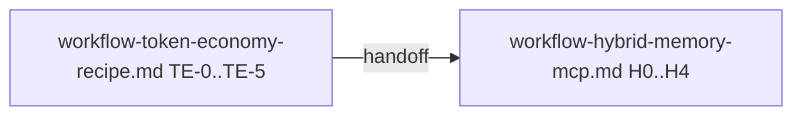

# Workflow-рецепт: токен-экономный анализ проекта (pager/SPM/shared-KB/diagnostics)

Документ — **workflow-рецепт** (не стратегия): пошаговые правила, артефакты и критерии приёмки для реализации киллер-фич экономии токенов в `ailit`, дополненные историей решений, handoff-артефактами и порядком передачи во второй workflow [`workflow-hybrid-memory-mcp.md`](workflow-hybrid-memory-mcp.md).

Канон процесса разработки репозитория: [`.cursor/rules/project-workflow.mdc`](../.cursor/rules/project-workflow.mdc).  
Стратегический контекст ветки: [`deploy-project-strategy.md`](deploy-project-strategy.md).  
Порядок ветки в корневом статусе: [`README.md`](../README.md).

## Порядок выполнения с [`workflow-hybrid-memory-mcp.md`](workflow-hybrid-memory-mcp.md)

Этот файл идёт **первым**. Он должен оставить после себя каноническую постановку, термины, артефакты, тестовый протокол и список решений, чтобы второй workflow не начинался «с пустого места».

Переход во второй документ разрешён только после закрытия этапов **TE-0 … TE-5** и выполнения критерия перехода в конце файла.



---

## История решений

Маркеры добавляются **в порядке истории**. Старые решения не переписывать; новые расхождения фиксировать новой строкой.

| Дата | Событие |
|------|---------|
| 2026-04 | Зафиксирована цель: уменьшить токеновую стоимость анализа проекта без потери качества ответа. |
| 2026-04 | В качестве механизмов первой ветки записаны `Context Pager`, `SPM`, `tool output budget`, `prune`, диагностика и воспроизводимый эксперимент на одинаковых задачах. |
| 2026-04 | Зафиксирован переход от идеи «только локальная экономия» к **hybrid memory**: приватная рабочая память + shared KB / MCP, без «простынь» в чате. |
| 2026-04 | Создан связанный второй workflow [`workflow-hybrid-memory-mcp.md`](workflow-hybrid-memory-mcp.md) для продолжения после постановки и handoff-артефактов из этого файла. |
| 2026-04 | Закрыта **постановка** этапов **TE-0.0–TE-5.2** в этом документе: добавлены §0.2–0.3, §1.0–1.0.1, §2.5, §3.8, §4.4–4.5, §5.7–5.8, §6 сводка, §9.1–9.2; продуктовые вопросы для `H0` оставлены **DEFERRED** с владельцем и датой во втором workflow. |

---

## 0. Ключевая идея

Сделать так, чтобы агент **почти никогда** не тащил простыни в `messages`, а работал через:

- **Context Pager**: большие куски контента -> страницы (`page_id`) + короткие превью.
- **SPM (Semantic Patch Memory)**: вместо памяти-о-тексте хранить память-об-изменениях (что / почему / инварианты) + ссылки на pages.
- **Tool output budget + prune**: ограничить вес tool results и уметь чистить старые результаты без потери корректности.
- **Навигацию через LSP, когда доступно** (fast path), с fallback на `grep` / `glob` / `read`.
- **Shared KB / MCP и progressive disclosure**: межагентный и межсессионный обмен идёт через индекс и `fetch-by-id`, а не через сырые вставки.

Цель: увеличить долю **cache_read_tokens** (или эквивалента у провайдера), уменьшить **input_tokens** на одинаковых задачах и подготовить каноническую постановку для следующей итерации `workflow-hybrid-memory-mcp.md`.

## 0.1. Non-goals первой итерации

В этот workflow **не входят**, если не появится отдельная постановка:

- замена модели/провайдера как главный способ экономии;
- полный редизайн UI/TUI чата;
- универсальная enterprise-KB для всех продуктов вне контекста `ailit`;
- копипаста архитектуры доноров без адаптации к текущему репозиторию.
- **полная интеграция shared MCP / vault / org-scope** (это второй workflow [`workflow-hybrid-memory-mcp.md`](workflow-hybrid-memory-mcp.md); здесь только постановка, контракты и локальная экономия в runtime).
- **memory governance / token governance как отдельный продуктовый слой** уровня [`workflow-memory-3.md`](workflow-memory-3.md) (после закрытия первых двух workflow).

### Граница с [`workflow-hybrid-memory-mcp.md`](workflow-hybrid-memory-mcp.md)

| Этот документ (recipe, TE-*, W-TE-*) | Второй workflow (H0–H4) |
|-------------------------------------|-------------------------|
| Термины, контракты `Page` / `SPM` / shared KB, правила рецепта, диагностические имена событий, протокол benchmark, handoff-список | Конкретные решения по MCP, scopes, политике записи в KB, код в `ailit` и CLI |
| Локальная экономия: pager, budget, prune, mailbox-артефакты в постановке | Транспорт, доверие, нормализация записей, retrieval в shared-слое |

---

## 0.2. Закрытие TE-0.1 — проблема, источники потерь, метрики, базовая диагностика

**Проблема:** в `ailit` контекстное окно `messages` раздувается из-за больших **tool results** (чтение файлов, `grep`, shell), повторных вставок одних и тех же кусков, отсутствия **pager/budget/prune**, мультиагентных **простыней** в mailbox и накопления истории без компактации; параллельно растёт **input_tokens** и падает доля **cache_read_tokens**, если превью и замещения недетерминированы.

**Источники токеновых потерь (канонический перечень):**

1. Полноразмерные tool outputs в истории диалога.
2. Многоходовые циклы «прочитал слишком широко → исправил» без navigation-first.
3. Дублирование одного и того же текста вместо ссылок на `page_id` / `kb_record_id`.
4. Отсутствие лимита на суммарный tool output за turn (budget) и отсутствие prune устаревших результатов.
5. Большие неструктурированные вставки в `agent.mailbox` вместо артефактов.
6. Накопление устаревших tool blocks без compaction / continuation-prompt.

**Метрики успеха (минимум одна зафиксирована; используем набор):**

- первичная: **снижение Σ `input_tokens`** на фиксированном наборе prompts при нехудшем качестве (§5.4);
- вспомогательные: рост **Σ `cache_read_tokens`** при стабильных превью; **`pages_created` > 0** на токеноёмких задачах; **`saved_percent` / `savings_ratio`** (§4.3) — «сырой объём обработан vs вошёл в контекст».

**Базовые события диагностики (уже в продукте, §4.1):** `model.request`, `model.response`, `tool.call_started`, `tool.call_finished`, `session.budget` — см. [`tools/agent_core/session/loop.py`](../tools/agent_core/session/loop.py) (ориентир строк `208–218`, `606–618`).

---

## 0.3. Закрытие TE-0.2 — non-goals и разграничение

Non-goals перечислены в **§0.1** (не менее шести пунктов после расширения). Разграничение с hybrid — в таблице выше в **§0.1**.

---

## 1. Доноры (референсы) — обязательные ссылки на существующие репозитории

Ниже перечислены именно те локальные репозитории и файлы, на которые нужно ссылаться при выполнении задач этой ветки.

### 1.0. Закрытие TE-1.1 — сравнительная таблица подходов

| Подход | Плюс | Минус | Когда уместно | Локальный донор (путь, строки) |
|--------|------|-------|---------------|--------------------------------|
| **Raw chat / полный дамп в контекст** | Простота, нет инфраструктуры | Быстрый рост `input_tokens`, нет cache prefix | Только короткие сессии | — (антипаттерн) |
| **Truncation / compaction без артефактов** | Снимает переполнение | Потеря деталей, риск «литературного» резюме | Экстренный сброс | `/home/artem/reps/opencode/packages/opencode/src/session/compaction.ts` `87–135`; §3.5 этого файла |
| **Context Pager (`page_id` + preview)** | Большие куски вне `messages`, стабильный маркер | Нужна реализация и UX догрузки | Любые большие tool outputs | `/home/artem/reps/claude-code/utils/toolResultStorage.ts` `367–474`; §2.1 |
| **SPM / patch-memory** | Память об изменениях, меньше повторов текста | Нужна дисциплина записи | Длинные сессии правок | §2.2; `/home/artem/reps/ruflo/plan/01_project_memory.md` `26–41` |
| **Shared KB + index-first + fetch-by-id** | Межсессионное знание, progressive disclosure | Нужны scope и нормализация | Команда / мультиагент | `/home/artem/reps/ai-multi-agents/docs/readme_agents.cursor.md` `101–117`; §2.3 |
| **Hybrid memory (приватная рабочая + shared MCP)** | Сочетает pager/SPM/KB с политикой владения | Два слоя, больше постановки | Целевая архитектура ветки после recipe | §0, §1.6; [`workflow-hybrid-memory-mcp.md`](workflow-hybrid-memory-mcp.md) |

Из таблицы следует выбор **hybrid memory** как целевого состояния ветки: локальные механизмы (pager, budget, prune, mailbox) готовят runtime, shared-слой и MCP закрываются во втором workflow.

### 1.0.1. Закрытие TE-1.2 — индекс точек входа по темам

| Тема | Где в §1 |
|------|-----------|
| Стабильные замещения tool results | §1.2 `claude-code` … `toolResultStorage.ts` |
| Prune / truncation сервис | §1.3 `opencode` … `compaction.ts`, `truncate.ts` |
| BM25 / index-first / sandbox | §1.1 `context-mode` … `README`, `store.ts`, `BENCHMARK.md` |
| Project memory / progressive disclosure | §1.4 `ruflo` … `01_project_memory.md` |
| Context autopilot | §1.5 `ai-multi-agents` … `context_autopilot.py` |
| MCP memory / vault / graph (вторая итерация) | §1.6 |
| Token governance (идеи для M3) | §1.4 `ruflo` … `03_token_optimization.md` |

### 1.1. `context-mode` (`/home/artem/reps/context-mode`)

1. Sandbox tools и continuity через SQLite/FTS5:
   - `/home/artem/reps/context-mode/README.md`, строки `32–41`.
   - Идея: сырой объём остаётся вне контекста; в память попадает только индекс и релевантное.
2. Knowledge base и compact retrieval:
   - `/home/artem/reps/context-mode/src/store.ts`, строки `66–120`, `145–149`.
   - Идея: dedupe, stopwords, ограничение размера куска для BM25.
3. Аналитика экономии:
   - `/home/artem/reps/context-mode/src/session/analytics.ts`, строки `26–114`.
4. Методология benchmark:
   - `/home/artem/reps/context-mode/BENCHMARK.md`, строки `8–16`, `137–150`.

### 1.2. `claude-code` (`/home/artem/reps/claude-code`)

1. Стабильные замещения tool results:
   - `/home/artem/reps/claude-code/utils/toolResultStorage.ts`, строки `367–474`.
2. Dynamic tool loading / tool search:
   - `/home/artem/reps/claude-code/utils/toolSearch.ts`, строки `44–152`.
3. Transcript search по реально видимым данным:
   - `/home/artem/reps/claude-code/utils/transcriptSearch.ts`, строки `17–60`.

### 1.3. `opencode` (`/home/artem/reps/opencode`)

1. Prune старых outputs:
   - `/home/artem/reps/opencode/packages/opencode/src/session/compaction.ts`, строки `87–135`.
2. Truncation как сервис:
   - `/home/artem/reps/opencode/packages/opencode/src/tool/truncate.ts`, строки `15–126`.

### 1.4. `ruflo` (`/home/artem/reps/ruflo`)

1. Token governance как отдельный policy-слой:
   - `/home/artem/reps/ruflo/plan/03_token_optimization.md`, строки `34–70`, `106–133`.
2. Project memory и progressive disclosure:
   - `/home/artem/reps/ruflo/plan/01_project_memory.md`, строки `26–41`, `87–92`.

### 1.5. `ai-multi-agents` (`/home/artem/reps/ai-multi-agents`)

1. Index-first чтение канонического знания:
   - `/home/artem/reps/ai-multi-agents/docs/readme_agents.cursor.md`, строки `101–117`.
2. Многослойная память и derived retrieval memory:
   - `/home/artem/reps/ai-multi-agents/plans/ai-memory.md`, строки `40–48`, `180–199`.
3. Context autopilot:
   - `/home/artem/reps/ai-multi-agents/tools/runtime/context_autopilot.py`, строки `16–69`.

### 1.6. Доноры для второй итерации hybrid memory

Эти ссылки особенно важны для согласования со следующим workflow:

- `/home/artem/reps/obsidian-memory-mcp/README.md`, строки `11–19`, `29–55`, `71–79`.
- `/home/artem/reps/hindsight/README.md`, строки `20–23`.
- `/home/artem/reps/letta/README.md`, строки `47–62`.
- `/home/artem/reps/graphiti/README.md`, строки `38–40`, `42–55`, `65–70`.

---

## 2. Артефакты и структуры данных (то, что нужно в `ailit`)

### 2.1. `Page` (Context Pager)

**Назначение:** хранить большие тексты вне контекста, а в `messages` держать только превью и `page_id`.

Минимальная модель (черновик контракта):

- `page_id`: стабильный идентификатор, например `p_<hash>`;
- `source`: `file_read`, `grep`, `shell`, `web_fetch`, `manual`;
- `locator`: путь/диапазон/команда/запрос;
- `preview`: короткий детерминированный текст;
- `bytes_total`, `bytes_preview`;
- `created_at`, `session_id`, `turn_index`.

**Критично:** `preview` и формат page marker должны быть **детерминированными** (иначе ломаем prompt cache).

### 2.2. `SPM` (Semantic Patch Memory)

**Назначение:** резюмировать сессию в виде состояния изменений, а не копии контекста.

Минимальные поля:

- `goal`;
- `decisions`;
- `changes`;
- `invariants`;
- `active_files`;
- `next_steps`.

**Граница:** `SPM` — долгоживущий слой внутри сессии; `pages` — ephemeral-слой, который можно чистить агрессивнее; `shared KB` — нормализованная память между агентами и сессиями.

### 2.3. Shared Knowledge Base

Назначение: общая база устойчивых знаний проекта, которая использует progressive disclosure.

Минимальный MVP-слой:

- типы записей:
  - `architectural`;
  - `module-contract`;
  - `episodic`;
  - `working`;
- index-first retrieval:
  - сначала индекс: `title`, `type`, `scope`, `importance`, `retrieval_cost_estimate`;
  - затем 1–3 `fetch by id`;
- isolation by default:
  - worker-агент читает свой scope и релевантные контракты;
  - coordinator видит summaries и contract diffs.

### 2.4. Канонические ограничения

Эти пункты переходят во второй workflow **без ослабления**:

1. Любая запись в shared KB маркируется scope: `org` | `workspace` | `project` | `agent` | `run`.
2. Сырые логи, большие stack traces и неструктурированный вывод не пишутся в KB без нормализации.
3. Retrieval всегда идёт по схеме `index-first`, а не через чтение полного архива.
4. Конфликты записей требуют явного правила приоритета (`supersedes`, timestamp, manual review).

### 2.5. Закрытие TE-2.1 — контракты и границы слоёв

- **`Page`:** внешнее хранилище большого текста; в контексте только превью + `page_id` (§2.1).
- **`SPM`:** состояние сессии «что изменилось / инварианты», не дубликат сырого лога (§2.2).
- **Shared KB:** нормализованные записи между сессиями и агентами; только **index-first** и scope (§2.3, §2.4).
- **Не смешивать:** session memory (`pages`, `SPM`, turn-local tool history) и shared KB; гибридная политика владения и MCP — во втором workflow, **H0–H2** [`workflow-hybrid-memory-mcp.md`](workflow-hybrid-memory-mcp.md).

---

## 3. Workflow: токен-экономный анализ проекта (рецепт)

### 3.1. Правило 0: «Сначала навигация, потом чтение»

1. Сформулировать, что именно ищем: символ / функцию / endpoint / config path.
2. Попробовать fast-path:
   - LSP: `workspaceSymbol` -> `definition` -> `references` -> `call hierarchy`.
3. Если LSP недоступен или неполон:
   - `glob` -> `grep` -> `read` только нужных диапазонов.

**Запрещено:** читать целые крупные файлы на всякий случай.

### 3.2. Правило 1: «Любой крупный вывод -> Pager»

Когда `read` / `grep` / `shell` / `web` возвращают большой текст:

- сохранить полный текст как `page`;
- в контекст вернуть только:
  - маркер `PAGE <page_id>`;
  - 10-30 строк превью;
  - инструкцию, как запросить продолжение page (`offset` / `section`).

Ожидаемый результат: количество простыней в `TOOL`-сообщениях падает, а повторные чтения становятся точечными.

### 3.3. Правило 2: «Tool result budget + стабильные замещения»

Если в одном turn накопилось слишком много tool-output:

- оставить свежие результаты;
- самые большие заменить на `PAGE` + короткий preview;
- решения заменено / не заменено должны быть **стабильны** между ходами (как у Claude Code).

### 3.4. Правило 3: «Prune старых tool outputs»

При приближении к лимиту контекста:

- очистить outputs старых tool calls (оставить placeholders);
- защищать критичные tool-типы (пример OpenCode: `skill`);
- не трогать последние 1-2 user turns.

### 3.5. Правило 4: «Compaction делает continuation-prompt, не литературное резюме»

Compaction должен генерировать структурированный continuation-prompt (`Goal` / `Instructions` / `Discoveries` / `Accomplished` / `Relevant files`) в стиле OpenCode и сохранять его как SPM-ядро.

### 3.6. Правило 5: изолированный контекст и обмен артефактами

Для мультиагентной работы:

- рабочий агент получает только модульный scope, контракт и 1–3 KB записи по id;
- в mailbox запрещены большие вставки текста;
- разрешены `page_id`, `kb_record_id`, краткий summary и structured status.

### 3.7. Тактики экономии контекста

1. Sandbox-подход для больших данных.
2. Think in code: писать анализатор, который возвращает итог, а не все промежуточные данные.
3. Index-first retrieval для KB.
4. Token governance слой:
   - `TokenBudgetManager`;
   - `ContextPackBuilder`;
   - `ToolExposurePolicy`;
   - `SemanticResponseCache`;
   - `PromptProfileRegistry`.
5. Selective tool exposure / tool search.
6. Детерминизм превью и замещений ради cache prefix.

### 3.8. Закрытие TE-2.2 — канонические правила и проверяемость

Минимум шести правил ниже сопоставлены с диагностикой из §4.2 / пользовательским слоем §4.3.

| Правило (рецепт) | Проверка / диагностика |
|------------------|-------------------------|
| §3.1 navigation-first | `lsp.nav.used`, `lsp.nav.fallback`; негатив: рост `input_tokens` без прогресса (§4.3) |
| §3.2 крупный вывод → pager | `context.pager.page_created`, `context.pager.page_used` |
| §3.3 budget + стабильные замещения | `tool.output_budget.enforced`; determinism: §8.3, W-TE-2 |
| §3.4 prune | `tool.output_prune.applied`, `session.budget` без аварии до overflow |
| §3.5 compaction = continuation | связка с `SPM` / размер динамического слоя; `context.layering.snapshot` (при внедрении) |
| §3.6 mailbox без простынь | `agent.mailbox.sent` / `received` — байты, число ссылок vs сырого текста |
| §3.7 тактики (index-first KB) | `kb.index_built`, `kb.query`, `kb.fetch` |

---

## 4. Диагностика: как показать пользователю, что токены экономятся

### 4.1. Базовый слой (уже есть в `ailit`)

В `session loop` уже эмитятся события:

- `model.request` (число сообщений контекста, `tools_count`);
- `model.response` (usage + totals);
- `tool.call_started` / `tool.call_finished`;
- `session.budget` (превышение).

См. `/home/artem/reps/ailit-agent/tools/agent_core/session/loop.py`, например строки `208–218`, `606–618`.

### 4.2. Что должно появиться в этой ветке

Нужно, чтобы диагностика показывала **механизмы экономии** и их эффект:

1. `context.pager.page_created`
   - `page_id`, `source`, `bytes_total`, `bytes_preview`, `preview_lines`, `locator`.
2. `context.pager.page_used`
   - `page_id`, зачем страница догружалась, какой диапазон запросили.
3. `tool.output_budget.enforced`
   - `limit`, `total_before`, `total_after`, `replaced_count`, список `page_id`.
4. `tool.output_prune.applied`
   - `pruned_tools_count`, `pruned_bytes_estimate`, `protected_tools`.
5. `context.layering.snapshot`
   - размеры слоёв: system/static, dynamic, pages.
6. `lsp.nav.used`
   - какие операции использовали и сколько символов/диапазонов выбрали.
7. `lsp.nav.fallback`
   - когда fast-path не сработал и был переход на `grep` / `glob` / `read`.
8. `kb.index_built`
   - сколько записей в индексе, какой scope, какая оценка стоимости.
9. `kb.query`
   - сколько записей найдено, сколько id выбрано, оценка retrieval cost.
10. `kb.fetch`
   - какие id дочитали, сколько байт/символов реально вошло в контекст.
11. `agent.mailbox.sent`
   - размер сообщения (`bytes/chars`), сколько ссылок (`page_id`, `kb_record_id`) и сколько сырого текста.
12. `agent.mailbox.received`
   - размер, число артефактов, факт наличия/отсутствия больших вставок.

### 4.3. Что показывать пользователю

Минимум для UI/CLI и JSONL:

1. **Панель `Token economy`:**
   - `input_tokens`, `output_tokens`, `reasoning_tokens`, `cache_read_tokens`, `cache_write_tokens`;
   - `turn input tokens` и среднее за `N` turns.
2. **Счётчики механизмов:**
   - `pages_created`, `pages_used`;
   - `tool_output_replaced_count`, `tool_output_pruned_count`;
   - `compaction_count`, `last_compaction_size`.
3. **Негативные сигналы:**
   - рост `input_tokens` без роста progress;
   - частые `context_budget_exceeded`.
4. **Сбережение вне контекста:**
   - `raw_bytes_processed` vs `context_bytes_entered`;
   - `saved_percent` / `savings_ratio`.

### 4.4. Закрытие TE-3.1 — новые события: минимальные поля и проверяемый эффект

События из §4.2 (не дублируют `model.request` / `model.response` из §4.1). Для каждого — минимальные поля и ожидаемый эффект в JSONL/отчёте.

| Событие | Минимальные поля | Проверяемый эффект |
|---------|------------------|-------------------|
| `context.pager.page_created` | `page_id`, `source`, `bytes_total`, `bytes_preview`, `locator` | большой output не целиком в `messages`; счётчик `pages_created` |
| `context.pager.page_used` | `page_id`, `reason`, `range_or_offset` | догрузка по запросу, не повтор полного текста |
| `tool.output_budget.enforced` | `limit`, `total_before`, `total_after`, `replaced_count`, `page_id[]` | снижение объёма tool-текста в контексте за turn |
| `tool.output_prune.applied` | `pruned_tools_count`, `pruned_bytes_estimate`, `protected_tools` | старые outputs убраны; защищённые типы целы |
| `context.layering.snapshot` | размеры слоёв (static / dynamic / pages) | видимость «где сидят» токены |
| `lsp.nav.used` / `lsp.nav.fallback` | операции, объёмы выборки | navigation-first vs откат на grep/read |
| `kb.index_built` | `record_count`, `scope`, `retrieval_cost_estimate` | KB готова к index-first |
| `kb.query` | `hits`, `selected_ids`, `cost_estimate` | сначала индекс, без `full_content` |
| `kb.fetch` | `ids[]`, `bytes_in_context` | progressive disclosure по id |
| `agent.mailbox.sent` / `received` | `bytes`, `link_count` (`page_id`, `kb_record_id`), `raw_text_ratio` | нет простынь в mailbox |

### 4.5. Закрытие TE-3.2 — пользовательское представление экономии

Сопоставление с §4.3:

- **Token metrics:** `input_tokens`, `output_tokens`, `reasoning_tokens`, `cache_read_tokens`, `cache_write_tokens`, среднее за `N` turns.
- **Paging / budget / prune metrics:** `pages_created`, `pages_used`, `tool_output_replaced_count`, `tool_output_pruned_count`, `compaction_count`.
- **Negative signals:** рост `input_tokens` без прогресса; частые `context_budget_exceeded` (см. §4.3 п.3).
- **Outside context savings:** `raw_bytes_processed` vs `context_bytes_entered`, `saved_percent` / `savings_ratio` (§4.3 п.4).

---

## 5. Эксперимент: сравнение до/после на DeepSeek на одинаковых задачах

### 5.1. Принципы эксперимента

- Один и тот же репозиторий, одна и та же фиксация (`commit hash`).
- Один и тот же набор задач (`prompts`).
- Одинаковая модель (`deepseek-chat` или `deepseek-reasoner`) и температура.
- Запуск минимум 3 раза (среднее / медиана).
- Сохранять JSONL диагностику, чтобы сравнение не было на глаз.

### 5.2. Реальный ключ DeepSeek

В репозитории уже есть guardrails, что без ключа DeepSeek запуск live-сценариев не обязателен, и есть smoke, который пропускается без env:

- `/home/artem/reps/ailit-agent/tests/e2e/test_chat_app_e2e.py`, строки `15–20` — skip unless `AILIT_E2E_CHAT=1`.
- `/home/artem/reps/ailit-agent/user-test.md`, строки `85–92` — живой прогон `ailit agent run … --provider deepseek --model deepseek-chat`.

### 5.3. Базовые токеноёмкие задачи

Задачи должны быть токеноёмкими, чтобы pager / budget / prune и shared KB реально проявлялись:

1. «Найди, где формируется системный промпт / карта промпта и как добавить новый кусок».
2. «Найди, где считается usage и как вывести `cache_read_tokens` / `cache_write_tokens`».
3. «Найди, где происходит compaction / shortlist и как это влияет на контекст».

Важно: задачи должны требовать `grep` / `read`, иначе эффект экономии не будет заметен.

### 5.4. Метрики сравнения (таблица результатов)

Для каждой задачи и каждого прогона фиксировать:

- `Σ input_tokens`, `Σ output_tokens`;
- `Σ cache_read_tokens`, `Σ cache_write_tokens`;
- `turns`;
- `pages_created`, `pages_used`;
- `tool_output_replaced_count`, `tool_output_pruned_count`;
- `kb.query`, `kb.fetch`;
- `wall_clock_ms`, если есть.

Критерий успеха MVP:

- **input_tokens** уменьшаются минимум на заметный процент относительно baseline;
- при этом число turns не растёт существенно или падает;
- качество результата не деградирует по ручной оценке.

### 5.5. Как прогонять одинаковые задачи (воспроизводимо)

Техническая база в `ailit` уже есть:

- `ailit agent run` — прогон YAML workflow: `/home/artem/reps/ailit-agent/tools/ailit/cli.py`, строки `438–503`.
- `ailit agent usage last` — печать последней пары usage и session totals из JSONL-лога: `/home/artem/reps/ailit-agent/tools/ailit/cli.py`, строки `505–521`.

Рекомендуемый протокол прогона:

1. Подготовить workflow, который выполняет 1 задачу, то есть один prompt, чтобы JSONL лог был коротким и сравнимым.
2. Для каждого prompt сделать два прогона:
   - **baseline**: без включённых механизмов (`pager`, `budget`, `prune`, `shared KB`) или с минимальными лимитами;
   - **optimized**: с включёнными механизмами и теми же лимитами модели.
3. Каждый прогон сохранять в отдельный файл `run_*.jsonl` через перенаправление stdout.

Пример:

```bash
export DEEPSEEK_API_KEY=...
# 1) baseline
ailit agent run <workflow.yaml> --provider deepseek --model deepseek-chat > run_baseline.jsonl
ailit agent usage last --log-file run_baseline.jsonl

# 2) optimized (конкретные env/флаги будут определены в этапах W-TE-1..W-TE-3)
# export AILIT_TOKEN_ECONOMY_PAGER=1
# export AILIT_TOKEN_ECONOMY_TOOL_BUDGET=1
# export AILIT_TOKEN_ECONOMY_PRUNE=1
# export AILIT_TOKEN_ECONOMY_SHARED_KB=1
ailit agent run <workflow.yaml> --provider deepseek --model deepseek-chat > run_optimized.jsonl
ailit agent usage last --log-file run_optimized.jsonl
```

Выходной артефакт эксперимента:

- таблица (`CSV` или `Markdown`) с метриками из §5.4 для всех prompts;
- ссылки на `run_baseline.jsonl` и `run_optimized.jsonl`.

### 5.6. Тестерский сценарий на реальном репозитории: `introlab/odas`

Репозиторий для теста: `git@github.com:introlab/odas.git`.

**Идея теста:** сравнить baseline и optimized на **одних и тех же** двух запросах:

1. знакомство / ориентация в репозитории;
2. прикладная задача: сделать конфигурацию системы логирования.

#### 5.6.1. Подготовка окружения

```bash
export AILIT_ECON_TEST_ROOT="/tmp/ailit-token-econ"
rm -rf "${AILIT_ECON_TEST_ROOT}"
mkdir -p "${AILIT_ECON_TEST_ROOT}"
cd "${AILIT_ECON_TEST_ROOT}"
git clone git@github.com:introlab/odas.git odas
cd odas
```

#### 5.6.2. Запуск baseline

Запуск должен быть воспроизводимым: один prompt -> один JSONL.

**Prompt #1 (ориентация):**

> Ты запущен в репозитории `odas`. Дай краткую карту проекта: какие основные компоненты/модули, где entrypoint’ы, как устроена сборка/запуск.
> Важно: не читай весь репозиторий. Сначала найди `README`, файлы сборки/конфига, потом 3–7 самых релевантных файлов.
> В конце выдай список точек входа и где смотреть логирование.

**Prompt #2 (задача):**

> Нужно настроить конфигурацию системы логирования в `odas`.
> Укажи, где сейчас настраивается логирование, какие уровни/синки поддерживаются, и что нужно поменять, чтобы добавить или изменить конфигурацию (например через файл, флаг или переменную окружения).
> Дай пошаговый план правок по файлам (без написания кода в этом тесте) и перечисли критерии, как проверить, что логирование работает.

Команды прогона:

```bash
export DEEPSEEK_API_KEY=...
ailit agent run <workflow_prompt1.yaml> --provider deepseek --model deepseek-chat > run_odas_baseline_p1.jsonl
ailit agent run <workflow_prompt2.yaml> --provider deepseek --model deepseek-chat > run_odas_baseline_p2.jsonl
```

#### 5.6.3. Запуск optimized

Те же prompts, те же версии репозитория и модели. Отличие только в том, что включены механизмы экономии:

- Pager (`pages`);
- Tool output budget (stable replacements);
- Prune;
- Shared KB (`index-first` -> `fetch-by-id`; межагентные артефакты вместо простыней);
- Think in code, когда уместно.

Команды:

```bash
export DEEPSEEK_API_KEY=...
# export AILIT_TOKEN_ECONOMY_PAGER=1
# export AILIT_TOKEN_ECONOMY_TOOL_BUDGET=1
# export AILIT_TOKEN_ECONOMY_PRUNE=1
# export AILIT_TOKEN_ECONOMY_SHARED_KB=1
ailit agent run <workflow_prompt1.yaml> --provider deepseek --model deepseek-chat > run_odas_optimized_p1.jsonl
ailit agent run <workflow_prompt2.yaml> --provider deepseek --model deepseek-chat > run_odas_optimized_p2.jsonl
```

#### 5.6.4. Что сравниваем

Сравнение делаем по метрикам из §5.4 **на каждом prompt отдельно**, плюс итог по сумме:

- `Σ input_tokens` (главная цель);
- `Σ cache_read_tokens` / `Σ cache_write_tokens` (если провайдер отдаёт);
- `pages_created/used`, `tool_output_replaced/pruned`;
- `kb.query` / `kb.fetch` counts и размеры выдачи;
- `agent.mailbox.*` (если тест задействует субагентов).

### 5.7. Закрытие TE-4.1 — воспроизводимый benchmark (чеклист протокола)

Объединяет §5.1, §5.4, §5.5.

**Baseline vs optimized:** один commit hash репозитория, один набор prompts, одна модель и температура; **baseline** — без включённых механизмов token-economy (или с минимальными лимитами), **optimized** — с включёнными `pager` / `budget` / `prune` / shared KB после реализации W-TE-* (флаги не придумывать: только задокументированные в коде).

**Обязательные артефакты:** отдельные `run_*_baseline.jsonl` и `run_*_optimized.jsonl`; итоговая таблица (CSV или Markdown) по метрикам §5.4; ссылки на файлы в отчёте.

**Повторяемость:** минимум **3** прогона baseline и **3** прогона optimized на каждую задачу; в таблице указать `mean` / `median` по ключевым метрикам.

**Критерий успеха:** снижение Σ `input_tokens` относительно baseline при нехудшем качестве (ручная оценка ответа).

**Недопустимая деградация:** рост числа turns > **20%** от baseline без явного обоснования; провал задачи (не найдены файлы / неверный вывод по сравнению с baseline); потеря диагностических событий, из-за которых нельзя сравнить механизмы.

**Зависимость от флагов:** до появления реальных env/CLI из W-TE-1..3 в протоколе остаются закомментированные плейсхолдеры (как в §5.5) с пометкой «включить после merge».

### 5.8. Закрытие TE-4.2 — живой сценарий `introlab/odas`

Закрывается разделом **§5.6**: два prompt (#1 ориентация, #2 логирование), подготовка окружения **§5.6.1**, отдельные JSONL на baseline и optimized, метрики **§5.6.4** / §5.4.

**Проверка воспроизводимости:** prompts не требуют чтения всего репозитория; сравнение baseline vs optimized разделено по файлам лога.

Примечание: `workflow_prompt1.yaml` / `workflow_prompt2.yaml` — это намеренно плейсхолдеры. Файлы и флаги включения механизмов (`pager` / `budget` / `prune` / `shared KB`) добавляются в репозиторий только после реализации этапов `W-TE-1..W-TE-3`, чтобы тестер запускал строго поддержанный интерфейс.

---

## 6. Этапы работ первой итерации

Каждая задача ниже оформлена как инструкция исполнителю. При старте итерации агент должен открыть этот раздел и зафиксировать, какие подзадачи закрывает.

### TE-0.0. Старт итерации (kickoff)

**Промпт исполнителю:**  
«Открой этот файл с начала: §0–§5 и таблицу закрытия ниже. Зафиксируй в коммите/PR, какие задачи TE-* закрываешь в этой ветке правок. Если закрываешь только постановку — не трогай код и не требуй несуществующих флагов.»

**Критерии приёмки:** в коммите или PR есть явная строка вида `TE: закрываю TE-x.y …` или обновлена таблица «Сводка закрытия TE-*».

### Сводка закрытия TE-* (артефакты в этом документе)

| Задача | Где закрыто в документе | Примечание |
|--------|-------------------------|------------|
| TE-0.1 | §0.2 | источники потерь, метрики, базовые события |
| TE-0.2 | §0.1, §0.3 | ≥6 non-goals, граница с hybrid |
| TE-1.1 | §1.0 | таблица ≥5 подходов + вывод к hybrid |
| TE-1.2 | §1.0.1 | индекс точек входа |
| TE-2.1 | §2.1–§2.5 | контракты + границы слоёв |
| TE-2.2 | §3, §3.8 | правила + таблица к диагностике |
| TE-3.1 | §4.4 | события и поля |
| TE-3.2 | §4.5 | token / paging / negative / savings |
| TE-4.1 | §5.7 | benchmark checklist |
| TE-4.2 | §5.8, §5.6 | odas-сценарий |
| TE-5.1 | §9.1 | матрица W-TE → H* |
| TE-5.2 | §9.2 | пакет handoff |

### Этап TE-0. Проблема, границы и терминология

#### Задача TE-0.1 — Зафиксировать проблему и метрики

**Промпт исполнителю:**  
«Опиши текущую проблему расхода контекста в `ailit`: какие типы данных раздувают `messages`, какие механизмы уже есть, какими метриками будем измерять успех. Не предлагай код, только постановку и измеримость.»

**Критерии приёмки:**

- есть раздел с источниками токеновых потерь;
- зафиксирована хотя бы одна метрика успеха;
- перечислены базовые события диагностики.

**Тесты/проверки:**

- ручная проверка согласованности с разделами `0`, `4`, `5`;
- отсутствие противоречия с `README.md`.

#### Задача TE-0.2 — Зафиксировать non-goals

**Промпт исполнителю:**  
«Сформируй список того, что не входит в первую итерацию токен-экономии, чтобы не расползался scope. Отдельно пометь, что может перейти в следующий workflow.»

**Критерии приёмки:**

- перечислены не менее 4 non-goals;
- есть явное разграничение между этим файлом и `workflow-hybrid-memory-mcp.md`.

**Тесты/проверки:**

- ручная сверка с предусловием второго workflow.

### Этап TE-1. Доноры и сравнение подходов

#### Задача TE-1.1 — Свести карту подходов

**Промпт исполнителю:**  
«Собери сравнительную таблицу подходов к экономии контекста: raw chat, pager, SPM, shared KB, hybrid memory. Для каждого дай плюс, минус, когда уместно и какие локальные доноры это подтверждают.»

**Критерии приёмки:**

- таблица покрывает минимум 5 подходов;
- в таблице есть ссылки на локальные репозитории и строки;
- из таблицы логически следует выбор hybrid memory.

**Тесты/проверки:**

- ручная проверка наличия минимум 5 референсов на локальные доноры.

#### Задача TE-1.2 — Зафиксировать точки входа в донорах

**Промпт исполнителю:**  
«Собери компактный список файлов и строк в донорах, которые нужны исполнителю этой ветки: стабильные замещения, prune, BM25/index-first, project memory, context autopilot, MCP memory.»

**Критерии приёмки:**

- все перечисленные в разделе `1` точки входа присутствуют;
- ссылки пригодны для дальнейшего чтения без поиска по репозиториям.

**Тесты/проверки:**

- ручная проверка существования путей на машине разработчика.

### Этап TE-2. Канонизация артефактов и правил

#### Задача TE-2.1 — Описать контракты `Page`, `SPM`, `Shared KB`

**Промпт исполнителю:**  
«Сформулируй минимальные контракты для `Page`, `SPM` и Shared KB так, чтобы по ним можно было проектировать код и диагностику. Сразу учти детерминизм, progressive disclosure и межагентную изоляцию.»

**Критерии приёмки:**

- описаны поля и границы ответственности каждого слоя;
- не смешаны session memory и shared memory;
- правила согласованы с hybrid memory.

**Тесты/проверки:**

- ручная проверка согласованности с `workflow-hybrid-memory-mcp.md`, этапы `H0`, `H2`, `H3`.

#### Задача TE-2.2 — Зафиксировать рабочие правила рецепта

**Промпт исполнителю:**  
«Собери канонический рецепт работы агента: navigation-first, pager, stable replacements, prune, continuation prompt, mailbox by artifacts. Формулировки должны быть короткими и пригодными для проверки.»

**Критерии приёмки:**

- есть минимум 5 правил;
- каждое правило можно сопоставить с будущей диагностикой или тестом;
- нет правил, противоречащих ограничениям по scope и index-first.

**Тесты/проверки:**

- ручная сверка с разделами `3` и `4`.

### Этап TE-3. Диагностика и тестируемость

#### Задача TE-3.1 — Определить новые диагностические события

**Промпт исполнителю:**  
«Определи, какие диагностические события должны появиться, чтобы доказать работу pager, budget, prune, KB retrieval и mailbox. Укажи минимальные поля каждого события.»

**Критерии приёмки:**

- перечислены события pager, budget, prune, KB и mailbox;
- каждому событию соответствует проверяемый эффект.

**Тесты/проверки:**

- ручная сверка с acceptance-разделом и экспериментом;
- отсутствие дублирования существующих событий `model.request`/`model.response`.

#### Задача TE-3.2 — Определить пользовательское представление экономии

**Промпт исполнителю:**  
«Сформулируй, какие числа и индикаторы должен увидеть пользователь в JSONL/CLI/UI, чтобы было видно не только usage, но и сами механизмы экономии.»

**Критерии приёмки:**

- перечислены token metrics, paging metrics и negative signals;
- есть метрики ‘outside context savings’.

**Тесты/проверки:**

- ручная сверка с диагностическими событиями из TE-3.1.

### Этап TE-4. Эксперимент и проверки

#### Задача TE-4.1 — Зафиксировать воспроизводимый benchmark

**Промпт исполнителю:**  
«Опиши протокол baseline vs optimized на одинаковых prompts и одинаковом commit hash. Включи DeepSeek, JSONL-артефакты, число прогонов, итоговую таблицу и критерий успеха.»

**Критерии приёмки:**

- есть baseline/optimized protocol;
- перечислены обязательные артефакты;
- есть критерии успеха и недопустимой деградации.

**Тесты/проверки:**

- ручной check, что протокол не зависит от несуществующих флагов без пометки;
- ручной check, что можно повторить прогон минимум 3 раза.

#### Задача TE-4.2 — Зафиксировать живой сценарий на внешнем репозитории

**Промпт исполнителю:**  
«Подготовь тестовый сценарий на реальном репозитории `introlab/odas`: два одинаковых prompt, baseline и optimized, и список метрик для сравнения. Не придумывай код, только воспроизводимую процедуру.»

**Критерии приёмки:**

- зафиксированы 2 prompt;
- описано подготовительное окружение;
- перечислены метрики сравнения по каждому prompt.

**Тесты/проверки:**

- ручная проверка, что prompts не требуют чтения всего репозитория;
- ручная проверка, что сравнение отделяет baseline от optimized.

### Этап TE-5. Передача во второй workflow

#### Задача TE-5.1 — Сопоставить исторические рабочие пакеты W-TE-* с H-этапами

**Промпт исполнителю:**  
«Разложи зафиксированные рабочие пакеты `W-TE-1` pager, `W-TE-2` budget, `W-TE-3` prune, `W-TE-4` experiment по этапам второго workflow `H0–H4`. Покажи, где постановка заканчивается и где начинается код.»

**Критерии приёмки:**

- есть матрица `W-TE / артефакт / потребитель H*`;
- из матрицы видно, что `workflow-hybrid-memory-mcp.md` не дублирует постановку.

**Тесты/проверки:**

- ручная сверка со вторым workflow.

#### Задача TE-5.2 — Подготовить минимальный пакет handoff

**Промпт исполнителю:**  
«Собери список артефактов, без которых нельзя начинать `workflow-hybrid-memory-mcp.md`: словарь терминов, scope-ограничения, разрешённые типы записей, тестовый протокол, открытые решения или DEFERRED-вопросы.»

**Критерии приёмки:**

- список handoff-артефактов содержит не менее 5 пунктов;
- каждый пункт либо готов, либо помечен как `DEFERRED` с владельцем и датой пересмотра;
- handoff не противоречит предусловию второго workflow.

**Тесты/проверки:**

- ручная сверка с разделом `Открытые вопросы` во втором workflow.

---

## 7. Исторические рабочие пакеты W-TE-*

Этот раздел сохраняет исходную логику старого документа, но используется как вход во второй workflow, а не как разрешение немедленно писать код без handoff.

### W-TE-1. Pager (pages) и базовая диагностика

Сделать:

- сохранять большие outputs в pages;
- возвращать preview + `page_id`;
- добавить события `context.pager.*`.

**Реализация в `ailit` (вкл.):** `export AILIT_CONTEXT_PAGER=1`. Порог длины (символы UTF-8): `AILIT_CONTEXT_PAGER_MIN_CHARS` (default 4000). Превью: `AILIT_CONTEXT_PAGER_PREVIEW_LINES`, `AILIT_CONTEXT_PAGER_PREVIEW_CHARS`. Инструмент догрузки: `read_context_page`. События: `context.pager.page_created`, `context.pager.page_used`.

Проверки:

- `pages_created > 0` на токеноёмких задачах;
- `model.request.context_messages` не раздувается простынями;
- JSONL содержит события pager.
- **unit**: `PYTHONPATH=tools python3 -m pytest -q`;
- **ручной CLI (без сети)**: `ailit agent run <workflow> --provider mock` и в JSONL есть `context.pager.page_created`;
- **ручной CLI (DeepSeek, live)**: `export DEEPSEEK_API_KEY=...` и `ailit agent run <workflow> --provider deepseek --model deepseek-chat` — без overflow; pages создаются на больших выводах.

### W-TE-2. Tool output budget и стабильность

Сделать:

- per-turn/per-message лимит на суммарный tool output;
- стабильные решения о замещении.

**Реализация в `ailit`:** `export AILIT_TOOL_OUTPUT_BUDGET=1`, лимит суммы за батч: `AILIT_TOOL_OUTPUT_BUDGET_MAX_CHARS` (default 48000). Событие `tool.output_budget.enforced` (limit, total_before/after, replaced_count, page_id). Жадное сжатие детерминировано (max длина, затем `call_id`). См. `agent_core.session.tool_output_budget`.

Проверки:

- при повторном прогоне на той же задаче структура замещений совпадает (детерминизм);
- **determinism check**: 2 прогона одного и того же workflow / prompt -> сравнить, что `tool.output_budget.enforced` и список `page_id` или replacement decisions совпадают по порядку и составу;
- **регрессия cache prefix**: в логах usage / diag доля `cache_read_tokens` не падает из-за дрожания превью и замещений.

### W-TE-3. Prune старых outputs и reserved buffer

Сделать:

- prune по давности и/или токено-оценке;
- protected tools;
- резерв под compaction.

**Реализация в `ailit` (MVP):** `export AILIT_TOOL_PRUNE=1`. Оставляем «живыми» последние `AILIT_TOOL_PRUNE_KEEP_LAST` (default 6) TOOL-сообщений; срабатывание при `len(messages) >= AILIT_TOOL_PRUNE_MIN_MESSAGES` (default 28) и, если задано, `AILIT_TOOL_PRUNE_AT_CONTEXT_UNITS > 0` — ещё по оценке `BudgetGovernance.estimate_context_units`. `write_file` пропускается (без обрезки). Событие `tool.output_prune.applied`. См. `agent_core.session.tool_output_prune`. Резерв под compaction — по-прежнему через существующий `compact_messages` в `SessionSettings`.

**CLI (обзор):** `ailit agent token-econ report` — сводка по `ailit-agent-*.log` (счётчики `context.pager.*`, `tool.output_budget.*`, `tool.output_prune.*`).

Проверки:

- при приближении к лимиту контекста система не падает с overflow, а применяет prune / compaction;
- **stress сценарий**: workflow, генерирующий несколько больших tool outputs подряд (`grep` / `read` / длинный `bash` output) -> система выдаёт `tool.output_prune.applied` до `session.budget context_budget_exceeded`;
- **protected tools**: результаты защищённых tool-типов не очищаются.

### W-TE-4. Эксперимент на DeepSeek

Сделать:

- воспроизводимый прогон baseline/optimized;
- JSONL и итоговую таблицу.

Проверки:

- есть отчёт сравнения до/после по метрикам из §5.4 на одних и тех же задачах;
- **повторяемость**: минимум 3 прогона baseline и 3 прогона optimized -> таблица `median` / `mean`;
- **артефакты**: сохранены `run_baseline.jsonl`, `run_optimized.jsonl`, итоговый `report.md|csv` со ссылками.

---

## 8. Сводные критерии приёмки

### 8.1. Acceptance: Token Economy MVP

- Pager работает: есть `context.pager.page_created`, и большие output не живут в контексте целиком.
- Budget работает: есть `tool.output_budget.enforced`, решения детерминированы.
- Prune работает: есть `tool.output_prune.applied`, overflow предотвращается до аварии.
- Диагностика есть: usage, pager, budget, prune, KB, mailbox можно увидеть в JSONL/CLI.

### 8.2. Acceptance: Multi-agent readiness

- Worker-агенты получают модульный scope и 1–3 KB записи по id.
- Mailbox не содержит больших вставок, только ссылки и короткие summary.
- После завершения задачи может появиться SPM/KB-запись, пригодная для новой сессии через index-first retrieval.
- `kb.query` сначала возвращает индекс без `full_content`, затем идут 1–3 `kb.fetch` по id.

### 8.3. Обязательные проверки

- **unit**: `PYTHONPATH=tools python3 -m pytest -q`
- **style**: `python3 -m flake8 tools tests`
- **ручной CLI mock**: `ailit agent run <workflow> --provider mock`
- **ручной CLI DeepSeek**: `ailit agent run <workflow> --provider deepseek --model deepseek-chat`
- **determinism check**: 2 одинаковых прогона и сравнение replacement decisions
- **stress scenario**: несколько крупных outputs подряд
- **multi-agent smoke**: короткие mailbox payloads со ссылками, не простынями
- **KB progressive disclosure**: `kb.query` возвращает индекс, затем идут ограниченные `kb.fetch` по id

Если конкретная задача не меняет код, допускается закрывать её без запуска `pytest`/`flake8`, но тесты для следующего кодового этапа должны быть перечислены заранее.

---

## 9. Матрица передачи в [`workflow-hybrid-memory-mcp.md`](workflow-hybrid-memory-mcp.md)

| Артефакт из этого workflow | Что именно передаётся | Потребитель во втором workflow |
|---|---|---|
| Ключевая идея и ограничения | pager/SPM/shared-KB, scope, index-first, запрет raw dump | `H0`, `H1`, `H2`, `H3` |
| Контракты `Page` / `SPM` / Shared KB | термины, поля, границы ответственности | `H0`, `H2`, `H3` |
| Диагностические события | pager/budget/prune/kb/mailbox | `H4.2` |
| Протокол baseline vs optimized | JSONL, DeepSeek, metrics, report | `H4.1`, `H4.2` |
| Исторические пакеты `W-TE-1..4` | разбиение реализации на подтемы | `H1`, `H3`, `H4` |
| Открытые решения / deferred | орг vs workspace, vault vs SQLite, namespace vs deploy | `H0.2` |

### 9.1. Закрытие TE-5.1 — матрица `W-TE-*` → артефакт → этап `H*`

Постановка (термины, контракты, события, протоколы) заканчивается в **этом** файле; **код** MCP, vault и интеграция в `ailit` — во втором workflow.

| Пакет | Артефакт / результат | Где постановка | Где код / интеграция (`workflow-hybrid-memory-mcp.md`) |
|-------|----------------------|----------------|--------------------------------------------------------|
| **W-TE-1** pager | `page_id`, preview, события `context.pager.*` | §2.1, §3.2, §4.4 | `H3` retrieval-контракт к страницам; `H4` конфиг и CLI |
| **W-TE-2** budget | лимиты, `tool.output_budget.*`, детерминизм | §2.1–2.3, §3.3, W-TE-2 | `H4` observability; политика с `H1` если budget касается границ MCP |
| **W-TE-3** prune | `tool.output_prune.*`, protected tools | §3.4, W-TE-3 | `H4`; согласование с резервом под compaction — `H3` |
| **W-TE-4** experiment | baseline/optimized, JSONL, отчёт | §5, §5.7 | `H4.1`, `H4.2` |

Второй workflow **не дублирует** §2–§5: он ссылается на этот документ и добавляет scopes, транспорт MCP и запись в KB.

### 9.2. Закрытие TE-5.2 — минимальный пакет handoff во второй workflow

| # | Артефакт | Статус |
|---|----------|--------|
| 1 | Словарь терминов и идея ветки (`Page`, `SPM`, shared KB, index-first, mailbox) | **Готово:** §0, §2, §3 |
| 2 | Канонические ограничения (scope, запрет raw dump, index-first, конфликты) | **Готово:** §2.4 |
| 3 | Имена и поля диагностических событий | **Готово:** §4.4 |
| 4 | Протокол benchmark baseline/optimized и odas-сценарий | **Готово:** §5.7, §5.6 |
| 5 | История решений (хронология) | **Готово:** §«История решений» |
| 6 | Открытые продуктовые вопросы для старта `H0` | **DEFERRED** (см. [`workflow-hybrid-memory-mcp.md`](workflow-hybrid-memory-mcp.md) §«Открытые вопросы»): орг vs workspace MCP; vault vs SQLite; namespace второй KB; **владелец:** команда `ailit-agent`; **пересмотр:** 2026-07-01 или по согласованию |

Пока п.6 в статусе **DEFERRED**, формальный критерий перехода §10 п.3 выполняется, если во втором файле указаны те же три вопроса и владелец/дата. Полное снятие **DEFERRED** — отдельная микро-итерация постановки, не блокирует **H0.0** kickoff.

---

## 10. Критерий перехода к [`workflow-hybrid-memory-mcp.md`](workflow-hybrid-memory-mcp.md)

Переход разрешён, только если выполнено всё:

1. Закрыты задачи **TE-0.1–TE-0.2**, **TE-1.1–TE-1.2**, **TE-2.1–TE-2.2**, **TE-3.1–TE-3.2**, **TE-4.1–TE-4.2**, **TE-5.1–TE-5.2**.
2. В этом файле нет противоречий между историей решений, ключевой идеей, контрактами, тактиками и acceptance-критериями.
3. Открытые вопросы, нужные для старта `H0`, либо решены, либо помечены как `DEFERRED` с владельцем и датой пересмотра.
4. Во втором workflow обновлён блок предусловия и раздел открытых вопросов под актуальный handoff.

После перехода новые продуктовые и исследовательские вопросы снова фиксируются здесь, а кодовая/интеграционная детализация ведётся во втором workflow.

---

## Конец workflow

Если после закрытия этого файла работа по `H0–H4` не утверждена, агент останавливается и запрашивает research и постановку следующей цели по [`.cursor/rules/project-workflow.mdc`](../.cursor/rules/project-workflow.mdc).
