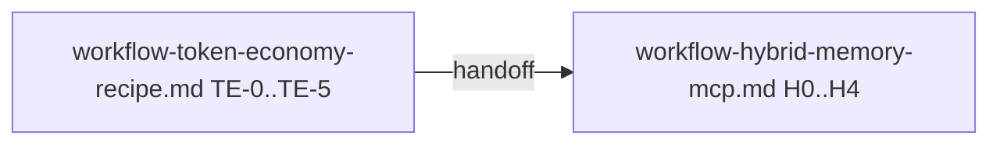

# Workflow-рецепт: токен-экономный анализ проекта (pager/SPM/shared-KB/diagnostics)

Документ — **workflow-рецепт первой итерации**, а не стратегия продукта: здесь собраны постановка, исторические решения, артефакты, доноры, правила работы, проверки и порядок передачи во второй workflow [`workflow-hybrid-memory-mcp.md`](workflow-hybrid-memory-mcp.md).

Канон процесса разработки репозитория: [`.cursor/rules/project-workflow.mdc`](../.cursor/rules/project-workflow.mdc).  
Стратегический контекст ветки: [`deploy-project-strategy.md`](deploy-project-strategy.md).  
Порядок ветки в корневом статусе: [`README.md`](../README.md).

## Порядок выполнения с [`workflow-hybrid-memory-mcp.md`](workflow-hybrid-memory-mcp.md)

Этот файл идёт **первым**. Он должен оставить после себя каноническую постановку, термины, артефакты, тестовый протокол и список решений, чтобы второй workflow не начинался «с пустого места».

Переход во второй документ разрешён только после закрытия этапов **TE-0 … TE-5** и выполнения критерия перехода в конце файла.



---

## История решений

Маркеры добавляются **в порядке истории**. Старые решения не переписывать; новые расхождения фиксировать новой строкой.

| Дата | Событие |
|------|---------|
| 2026-04 | Зафиксирована цель: уменьшить токеновую стоимость анализа проекта без потери качества ответа. |
| 2026-04 | В качестве механизмов первой ветки записаны `Context Pager`, `SPM`, `tool output budget`, `prune`, диагностика и воспроизводимый эксперимент на одинаковых задачах. |
| 2026-04 | Зафиксирован переход от идеи «только локальная экономия» к **hybrid memory**: приватная рабочая память + shared KB / MCP, без «простынь» в чате. |
| 2026-04 | Создан связанный второй workflow [`workflow-hybrid-memory-mcp.md`](workflow-hybrid-memory-mcp.md) для продолжения после постановки и handoff-артефактов из этого файла. |

---

## 0. Ключевая идея

Сделать так, чтобы агент **почти никогда** не тащил большие массивы данных в `messages`, а работал через несколько согласованных механизмов:

- **Context Pager**: большие куски контента превращаются в страницы (`page_id`) и короткие превью.
- **SPM (Semantic Patch Memory)**: вместо памяти-о-тексте хранится память-об-изменениях: что поменяли, почему, какие инварианты нельзя ломать.
- **Tool output budget + prune**: большие tool results не живут в контексте бесконтрольно; есть лимиты и механизм очистки.
- **Навигация через LSP / index-first**, а не чтение целых файлов «на всякий случай».
- **Shared KB / MCP и progressive disclosure**: межагентный и межсессионный обмен идёт через индекс и fetch-by-id, а не через сырые вставки.

Цель первой ветки: увеличить долю `cache_read_tokens` (или эквивалента у провайдера), уменьшить `input_tokens` на одинаковых задачах и подготовить каноническую постановку для следующей итерации `workflow-hybrid-memory-mcp.md`.

## 0.1. Non-goals первой итерации

В этот workflow **не входят**, если не появится отдельная постановка:

- замена модели/провайдера как главный способ экономии;
- полный редизайн UI/TUI чата;
- универсальная enterprise-KB для всех продуктов вне контекста `ailit`;
- копипаста архитектуры доноров без адаптации к текущему репозиторию.

---

## 1. Доноры и референсы

Ниже перечислены именно те локальные репозитории и файлы, на которые нужно ссылаться при выполнении задач этой ветки.

### 1.1. `context-mode` (`/home/artem/reps/context-mode`)

1. Sandbox tools и continuity через SQLite/FTS5:
   - `/home/artem/reps/context-mode/README.md`, строки `32–41`.
   - Идея: сырой объём остаётся вне контекста; в память попадает только индекс и релевантное.
2. Knowledge base и compact retrieval:
   - `/home/artem/reps/context-mode/src/store.ts`, строки `66–120`, `145–149`.
   - Идея: dedupe, stopwords, ограничение размера куска для BM25.
3. Аналитика экономии:
   - `/home/artem/reps/context-mode/src/session/analytics.ts`, строки `26–114`.
4. Методология benchmark:
   - `/home/artem/reps/context-mode/BENCHMARK.md`, строки `8–16`, `137–150`.

### 1.2. `claude-code` (`/home/artem/reps/claude-code`)

1. Стабильные замещения tool results:
   - `/home/artem/reps/claude-code/utils/toolResultStorage.ts`, строки `367–474`.
2. Dynamic tool loading / tool search:
   - `/home/artem/reps/claude-code/utils/toolSearch.ts`, строки `44–152`.
3. Transcript search по реально видимым данным:
   - `/home/artem/reps/claude-code/utils/transcriptSearch.ts`, строки `17–60`.

### 1.3. `opencode` (`/home/artem/reps/opencode`)

1. Prune старых outputs:
   - `/home/artem/reps/opencode/packages/opencode/src/session/compaction.ts`, строки `87–135`.
2. Truncation как сервис:
   - `/home/artem/reps/opencode/packages/opencode/src/tool/truncate.ts`, строки `15–126`.

### 1.4. `ruflo` (`/home/artem/reps/ruflo`)

1. Token governance как отдельный policy-слой:
   - `/home/artem/reps/ruflo/plan/03_token_optimization.md`, строки `34–70`, `106–133`.
2. Project memory и progressive disclosure:
   - `/home/artem/reps/ruflo/plan/01_project_memory.md`, строки `26–41`, `87–92`.

### 1.5. `ai-multi-agents` (`/home/artem/reps/ai-multi-agents`)

1. Index-first чтение канонического знания:
   - `/home/artem/reps/ai-multi-agents/docs/readme_agents.cursor.md`, строки `101–117`.
2. Многослойная память и derived retrieval memory:
   - `/home/artem/reps/ai-multi-agents/plans/ai-memory.md`, строки `40–48`, `180–199`.
3. Context autopilot:
   - `/home/artem/reps/ai-multi-agents/tools/runtime/context_autopilot.py`, строки `16–69`.

### 1.6. Доноры для второй итерации hybrid memory

Эти ссылки особенно важны для согласования со следующим workflow:

- `/home/artem/reps/obsidian-memory-mcp/README.md`, строки `11–19`, `29–55`, `71–79`.
- `/home/artem/reps/hindsight/README.md`, строки `20–23`.
- `/home/artem/reps/letta/README.md`, строки `47–62`.
- `/home/artem/reps/graphiti/README.md`, строки `38–40`, `42–55`, `65–70`.

---

## 2. Артефакты и минимальные контракты

### 2.1. `Page` (Context Pager)

Назначение: хранить большие тексты **вне контекста**, а в сообщениях держать только превью и `page_id`.

Минимальный черновой контракт:

- `page_id`: стабильный идентификатор, например `p_<hash>`;
- `source`: `file_read`, `grep`, `shell`, `web_fetch`, `manual`;
- `locator`: путь/диапазон/команда/запрос;
- `preview`: короткий детерминированный текст;
- `bytes_total`, `bytes_preview`;
- `created_at`, `session_id`, `turn_index`.

Требование: формат preview и page marker должен быть **детерминированным**, иначе ломается prompt cache.

### 2.2. `SPM` (Semantic Patch Memory)

Назначение: держать смысл изменений, а не копию всего контекста.

Минимальные поля:

- `goal`;
- `decisions`;
- `changes`;
- `invariants`;
- `active_files`;
- `next_steps`.

Граница ответственности:

- `SPM` — долгоживущий слой внутри сессии/итерации;
- `pages` — более агрессивно очищаемый слой;
- `shared KB` — нормализованная память между агентами и сессиями.

### 2.3. Shared Knowledge Base

Назначение: общая база устойчивых знаний проекта, которая использует progressive disclosure.

Минимальный MVP-слой:

- типы записей:
  - `architectural`;
  - `module-contract`;
  - `episodic`;
  - `working`;
- index-first retrieval:
  - сначала индекс: `title`, `type`, `scope`, `importance`, `retrieval_cost_estimate`;
  - затем 1–3 `fetch by id`;
- isolation by default:
  - worker-агент читает свой scope и релевантные контракты;
  - coordinator видит summaries и contract diffs.

### 2.4. Канонические ограничения

Эти пункты переходят во второй workflow **без ослабления**:

1. Любая запись в shared KB маркируется scope: `org` | `workspace` | `project` | `agent` | `run`.
2. Сырые логи, большие stack traces и неструктурированный вывод не пишутся в KB без нормализации.
3. Retrieval всегда идёт по схеме `index-first`, а не через чтение полного архива.
4. Конфликты записей требуют явного правила приоритета (`supersedes`, timestamp, manual review).

---

## 3. Рецепт токен-экономной работы

### 3.1. Правило 0: сначала навигация, потом чтение

1. Сформулировать точную цель поиска: символ, функция, endpoint, config path.
2. Использовать fast-path:
   - LSP: symbol/definition/references/call hierarchy.
3. Если LSP недоступен:
   - `glob` -> `grep` -> `read` только нужных диапазонов.

Запрещено: читать крупные файлы целиком без подтверждённой необходимости.

### 3.2. Правило 1: любой крупный вывод уходит в Pager

Если `read`, `grep`, `shell`, `web` дают большой ответ:

- полный текст сохраняется как `page`;
- в контекст возвращается только:
  - `PAGE <page_id>`;
  - короткое preview;
  - инструкция, как догрузить продолжение.

### 3.3. Правило 2: tool output budget и стабильные замещения

Если в turn накопилось слишком много tool output:

- остаются свежие и критичные результаты;
- крупные результаты замещаются на `page_id + preview`;
- решения о замещении должны быть детерминированны между повторами.

### 3.4. Правило 3: prune старых outputs

При приближении к лимиту контекста:

- очищать старые tool outputs;
- защищать критичные типы инструментов;
- не трогать последние 1–2 user turns.

### 3.5. Правило 4: compaction — это continuation prompt, а не литературное эссе

Compaction должен производить структурированный continuation prompt:

- `Goal`;
- `Instructions`;
- `Discoveries`;
- `Accomplished`;
- `Relevant files`.

### 3.6. Правило 5: изолированный контекст и обмен артефактами

Для мультиагентной работы:

- рабочий агент получает только модульный scope, контракт и 1–3 KB записи по id;
- в mailbox запрещены большие вставки текста;
- разрешены `page_id`, `kb_record_id`, краткий summary и structured status.

### 3.7. Тактики экономии контекста

1. Sandbox-подход для больших данных.
2. Think in code: писать анализатор, который возвращает итог, а не все промежуточные данные.
3. Index-first retrieval для KB.
4. Token governance слой:
   - `TokenBudgetManager`;
   - `ContextPackBuilder`;
   - `ToolExposurePolicy`;
   - `SemanticResponseCache`;
   - `PromptProfileRegistry`.
5. Selective tool exposure / tool search.
6. Детерминизм превью и замещений ради cache prefix.

---

## 4. Диагностика и наблюдаемость

### 4.1. Базовый слой

В `ailit` уже есть события:

- `model.request`;
- `model.response`;
- `tool.call_started`;
- `tool.call_finished`;
- `session.budget`.

Точка входа: `/home/artem/reps/ailit-agent/tools/agent_core/session/loop.py`, строки `208–218`, `606–618`.

### 4.2. Что должно появиться в этой ветке

Минимальный набор новых событий:

1. `context.pager.page_created`
2. `context.pager.page_used`
3. `tool.output_budget.enforced`
4. `tool.output_prune.applied`
5. `context.layering.snapshot`
6. `lsp.nav.used`
7. `lsp.nav.fallback`
8. `kb.index_built`
9. `kb.query`
10. `kb.fetch`
11. `agent.mailbox.sent`
12. `agent.mailbox.received`

### 4.3. Что показывать пользователю

Минимум для UI/CLI и JSONL:

- `input_tokens`, `output_tokens`, `reasoning_tokens`;
- `cache_read_tokens`, `cache_write_tokens`;
- `pages_created`, `pages_used`;
- `tool_output_replaced_count`, `tool_output_pruned_count`;
- `raw_bytes_processed`, `context_bytes_entered`, `saved_percent`;
- негативные сигналы: рост `input_tokens` без прогресса, частые `context_budget_exceeded`.

---

## 5. Эксперимент и тестовый протокол

### 5.1. Принципы эксперимента

- один и тот же репозиторий и commit hash;
- один и тот же набор задач;
- одинаковая модель;
- минимум 3 прогона baseline и 3 прогона optimized;
- JSONL диагностика сохраняется как артефакт.

### 5.2. Реальный ключ DeepSeek

Guardrails и live smoke уже есть:

- `/home/artem/reps/ailit-agent/tests/e2e/test_chat_app_e2e.py`, строки `15–20`;
- `/home/artem/reps/ailit-agent/user-test.md`, строки `85–92`.

### 5.3. Базовые токеноёмкие задачи

1. Найти, где формируется системный промпт и как добавить новый кусок.
2. Найти, где считается usage и как вывести `cache_read_tokens` / `cache_write_tokens`.
3. Найти, где происходит compaction/shortlist и как это влияет на контекст.

### 5.4. Метрики

Для каждого прогона фиксировать:

- `Σ input_tokens`;
- `Σ output_tokens`;
- `Σ cache_read_tokens`;
- `Σ cache_write_tokens`;
- `turns`;
- `pages_created`, `pages_used`;
- `tool_output_replaced_count`;
- `tool_output_pruned_count`;
- `kb.query`, `kb.fetch`;
- `wall_clock_ms`, если доступно.

Критерий успеха MVP:

- `input_tokens` падают на заметный процент относительно baseline;
- число turns не растёт существенно;
- качество результата не деградирует по ручной оценке.

### 5.5. Воспроизводимый протокол запуска

Техническая база:

- `ailit agent run`: `/home/artem/reps/ailit-agent/tools/ailit/cli.py`, строки `438–503`;
- `ailit agent usage last`: `/home/artem/reps/ailit-agent/tools/ailit/cli.py`, строки `505–521`.

Скелет:

```bash
export DEEPSEEK_API_KEY=...
ailit agent run <workflow.yaml> --provider deepseek --model deepseek-chat > run_baseline.jsonl
ailit agent usage last --log-file run_baseline.jsonl

# будущие флаги/переменные определяются реализацией W-TE-1..W-TE-3
ailit agent run <workflow.yaml> --provider deepseek --model deepseek-chat > run_optimized.jsonl
ailit agent usage last --log-file run_optimized.jsonl
```

Выходные артефакты:

- `run_baseline.jsonl`;
- `run_optimized.jsonl`;
- итоговый `report.md` или `report.csv`.

### 5.6. Тестерский сценарий на `introlab/odas`

Репозиторий: `git@github.com:introlab/odas.git`.

Использовать два prompt:

1. ориентация в репозитории без чтения всего дерева;
2. анализ конфигурации логирования и план правок без написания кода.

Сравнение делать отдельно по каждому prompt и суммарно.

---

## 6. Этапы работ первой итерации

Каждая задача ниже оформлена как инструкция исполнителю. При старте итерации агент должен открыть этот раздел и зафиксировать, какие подзадачи закрывает.

### Этап TE-0. Проблема, границы и терминология

#### Задача TE-0.1 — Зафиксировать проблему и метрики

**Промпт исполнителю:**  
«Опиши текущую проблему расхода контекста в `ailit`: какие типы данных раздувают `messages`, какие механизмы уже есть, какими метриками будем измерять успех. Не предлагай код, только постановку и измеримость.»

**Критерии приёмки:**

- есть раздел с источниками токеновых потерь;
- зафиксирована хотя бы одна метрика успеха;
- перечислены базовые события диагностики.

**Тесты/проверки:**

- ручная проверка согласованности с разделами `0`, `4`, `5`;
- отсутствие противоречия с `README.md`.

#### Задача TE-0.2 — Зафиксировать non-goals

**Промпт исполнителю:**  
«Сформируй список того, что не входит в первую итерацию токен-экономии, чтобы не расползался scope. Отдельно пометь, что может перейти в следующий workflow.»

**Критерии приёмки:**

- перечислены не менее 4 non-goals;
- есть явное разграничение между этим файлом и `workflow-hybrid-memory-mcp.md`.

**Тесты/проверки:**

- ручная сверка с предусловием второго workflow.

### Этап TE-1. Доноры и сравнение подходов

#### Задача TE-1.1 — Свести карту подходов

**Промпт исполнителю:**  
«Собери сравнительную таблицу подходов к экономии контекста: raw chat, pager, SPM, shared KB, hybrid memory. Для каждого дай плюс, минус, когда уместно и какие локальные доноры это подтверждают.»

**Критерии приёмки:**

- таблица покрывает минимум 5 подходов;
- в таблице есть ссылки на локальные репозитории и строки;
- из таблицы логически следует выбор hybrid memory.

**Тесты/проверки:**

- ручная проверка наличия минимум 5 референсов на локальные доноры.

#### Задача TE-1.2 — Зафиксировать точки входа в донорах

**Промпт исполнителю:**  
«Собери компактный список файлов и строк в донорах, которые нужны исполнителю этой ветки: стабильные замещения, prune, BM25/index-first, project memory, context autopilot, MCP memory.»

**Критерии приёмки:**

- все перечисленные в разделе `1` точки входа присутствуют;
- ссылки пригодны для дальнейшего чтения без поиска по репозиториям.

**Тесты/проверки:**

- ручная проверка существования путей на машине разработчика.

### Этап TE-2. Канонизация артефактов и правил

#### Задача TE-2.1 — Описать контракты `Page`, `SPM`, `Shared KB`

**Промпт исполнителю:**  
«Сформулируй минимальные контракты для `Page`, `SPM` и Shared KB так, чтобы по ним можно было проектировать код и диагностику. Сразу учти детерминизм, progressive disclosure и межагентную изоляцию.»

**Критерии приёмки:**

- описаны поля и границы ответственности каждого слоя;
- не смешаны session memory и shared memory;
- правила согласованы с hybrid memory.

**Тесты/проверки:**

- ручная проверка согласованности с `workflow-hybrid-memory-mcp.md`, этапы `H0`, `H2`, `H3`.

#### Задача TE-2.2 — Зафиксировать рабочие правила рецепта

**Промпт исполнителю:**  
«Собери канонический рецепт работы агента: navigation-first, pager, stable replacements, prune, continuation prompt, mailbox by artifacts. Формулировки должны быть короткими и пригодными для проверки.»

**Критерии приёмки:**

- есть минимум 5 правил;
- каждое правило можно сопоставить с будущей диагностикой или тестом;
- нет правил, противоречащих ограничениям по scope и index-first.

**Тесты/проверки:**

- ручная сверка с разделами `3` и `4`.

### Этап TE-3. Диагностика и тестируемость

#### Задача TE-3.1 — Определить новые диагностические события

**Промпт исполнителю:**  
«Определи, какие диагностические события должны появиться, чтобы доказать работу pager, budget, prune, KB retrieval и mailbox. Укажи минимальные поля каждого события.»

**Критерии приёмки:**

- перечислены события pager, budget, prune, KB и mailbox;
- каждому событию соответствует проверяемый эффект.

**Тесты/проверки:**

- ручная сверка с acceptance-разделом и экспериментом;
- отсутствие дублирования существующих событий `model.request`/`model.response`.

#### Задача TE-3.2 — Определить пользовательское представление экономии

**Промпт исполнителю:**  
«Сформулируй, какие числа и индикаторы должен увидеть пользователь в JSONL/CLI/UI, чтобы было видно не только usage, но и сами механизмы экономии.»

**Критерии приёмки:**

- перечислены token metrics, paging metrics и negative signals;
- есть метрики ‘outside context savings’.

**Тесты/проверки:**

- ручная сверка с диагностическими событиями из TE-3.1.

### Этап TE-4. Эксперимент и проверки

#### Задача TE-4.1 — Зафиксировать воспроизводимый benchmark

**Промпт исполнителю:**  
«Опиши протокол baseline vs optimized на одинаковых prompts и одинаковом commit hash. Включи DeepSeek, JSONL-артефакты, число прогонов, итоговую таблицу и критерий успеха.»

**Критерии приёмки:**

- есть baseline/optimized protocol;
- перечислены обязательные артефакты;
- есть критерии успеха и недопустимой деградации.

**Тесты/проверки:**

- ручной check, что протокол не зависит от несуществующих флагов без пометки;
- ручной check, что можно повторить прогон минимум 3 раза.

#### Задача TE-4.2 — Зафиксировать живой сценарий на внешнем репозитории

**Промпт исполнителю:**  
«Подготовь тестовый сценарий на реальном репозитории `introlab/odas`: два одинаковых prompt, baseline и optimized, и список метрик для сравнения. Не придумывай код, только воспроизводимую процедуру.»

**Критерии приёмки:**

- зафиксированы 2 prompt;
- описано подготовительное окружение;
- перечислены метрики сравнения по каждому prompt.

**Тесты/проверки:**

- ручная проверка, что prompts не требуют чтения всего репозитория;
- ручная проверка, что сравнение отделяет baseline от optimized.

### Этап TE-5. Передача во второй workflow

#### Задача TE-5.1 — Сопоставить исторические рабочие пакеты W-TE-* с H-этапами

**Промпт исполнителю:**  
«Разложи зафиксированные рабочие пакеты `W-TE-1` pager, `W-TE-2` budget, `W-TE-3` prune, `W-TE-4` experiment по этапам второго workflow `H0–H4`. Покажи, где постановка заканчивается и где начинается код.»

**Критерии приёмки:**

- есть матрица `W-TE / артефакт / потребитель H*`;
- из матрицы видно, что `workflow-hybrid-memory-mcp.md` не дублирует постановку.

**Тесты/проверки:**

- ручная сверка со вторым workflow.

#### Задача TE-5.2 — Подготовить минимальный пакет handoff

**Промпт исполнителю:**  
«Собери список артефактов, без которых нельзя начинать `workflow-hybrid-memory-mcp.md`: словарь терминов, scope-ограничения, разрешённые типы записей, тестовый протокол, открытые решения или DEFERRED-вопросы.»

**Критерии приёмки:**

- список handoff-артефактов содержит не менее 5 пунктов;
- каждый пункт либо готов, либо помечен как `DEFERRED` с владельцем и датой пересмотра;
- handoff не противоречит предусловию второго workflow.

**Тесты/проверки:**

- ручная сверка с разделом `Открытые вопросы` во втором workflow.

---

## 7. Исторические рабочие пакеты W-TE-*

Этот раздел сохраняет исходную логику старого документа, но используется как вход во второй workflow, а не как разрешение немедленно писать код без handoff.

### W-TE-1. Pager (pages) и базовая диагностика

Сделать:

- сохранять большие outputs в pages;
- возвращать preview + `page_id`;
- добавить события `context.pager.*`.

Проверки:

- `pages_created > 0` на токеноёмких задачах;
- `model.request.context_messages` не раздувается простынями;
- JSONL содержит pager events.

### W-TE-2. Tool output budget и стабильность

Сделать:

- per-turn/per-message лимит на суммарный tool output;
- стабильные решения о замещении.

Проверки:

- повторный прогон даёт ту же структуру replacement decisions;
- доля `cache_read_tokens` не падает из-за дрожащих preview.

### W-TE-3. Prune старых outputs и reserved buffer

Сделать:

- prune по давности и/или токено-оценке;
- protected tools;
- резерв под compaction.

Проверки:

- stress-сценарий приводит к prune/compaction, а не к overflow;
- защищённые tools не очищаются.

### W-TE-4. Эксперимент на DeepSeek

Сделать:

- воспроизводимый прогон baseline/optimized;
- JSONL и итоговую таблицу.

Проверки:

- минимум 3 baseline и 3 optimized;
- сохранены `run_baseline.jsonl`, `run_optimized.jsonl`, `report.md|csv`.

---

## 8. Сводные критерии приёмки

### 8.1. Acceptance: Token Economy MVP

- Pager работает: есть `context.pager.page_created`, и большие output не живут в контексте целиком.
- Budget работает: есть `tool.output_budget.enforced`, решения детерминированы.
- Prune работает: есть `tool.output_prune.applied`, overflow предотвращается до аварии.
- Диагностика есть: usage, pager, budget, prune, KB, mailbox можно увидеть в JSONL/CLI.

### 8.2. Acceptance: Multi-agent readiness

- Worker-агенты получают модульный scope и 1–3 KB записи по id.
- Mailbox не содержит больших вставок, только ссылки и короткие summary.
- После завершения задачи может появиться SPM/KB-запись, пригодная для новой сессии через index-first retrieval.

### 8.3. Обязательные проверки

- **unit**: `PYTHONPATH=tools python3 -m pytest -q`
- **style**: `python3 -m flake8 tools tests`
- **ручной CLI mock**: `ailit agent run <workflow> --provider mock`
- **ручной CLI DeepSeek**: `ailit agent run <workflow> --provider deepseek --model deepseek-chat`
- **determinism check**: 2 одинаковых прогона и сравнение replacement decisions
- **stress scenario**: несколько крупных outputs подряд
- **multi-agent smoke**: короткие mailbox payloads со ссылками, не простынями

Если конкретная задача не меняет код, допускается закрывать её без запуска `pytest`/`flake8`, но тесты для следующего кодового этапа должны быть перечислены заранее.

---

## 9. Матрица передачи в [`workflow-hybrid-memory-mcp.md`](workflow-hybrid-memory-mcp.md)

| Артефакт из этого workflow | Что именно передаётся | Потребитель во втором workflow |
|---|---|---|
| Ключевая идея и ограничения | pager/SPM/shared-KB, scope, index-first, запрет raw dump | `H0`, `H1`, `H2`, `H3` |
| Контракты `Page` / `SPM` / Shared KB | термины, поля, границы ответственности | `H0`, `H2`, `H3` |
| Диагностические события | pager/budget/prune/kb/mailbox | `H4.2` |
| Протокол baseline vs optimized | JSONL, DeepSeek, metrics, report | `H4.1`, `H4.2` |
| Исторические пакеты `W-TE-1..4` | разбиение реализации на подтемы | `H1`, `H3`, `H4` |
| Открытые решения / deferred | орг vs workspace, vault vs SQLite, namespace vs deploy | `H0.2` |

---

## 10. Критерий перехода к [`workflow-hybrid-memory-mcp.md`](workflow-hybrid-memory-mcp.md)

Переход разрешён, только если выполнено всё:

1. Закрыты задачи **TE-0.1–TE-0.2**, **TE-1.1–TE-1.2**, **TE-2.1–TE-2.2**, **TE-3.1–TE-3.2**, **TE-4.1–TE-4.2**, **TE-5.1–TE-5.2**.
2. В этом файле нет противоречий между историей решений, ключевой идеей, контрактами, тактиками и acceptance-критериями.
3. Открытые вопросы, нужные для старта `H0`, либо решены, либо помечены как `DEFERRED` с владельцем и датой пересмотра.
4. Во втором workflow обновлён блок предусловия и раздел открытых вопросов под актуальный handoff.

После перехода новые продуктовые и исследовательские вопросы снова фиксируются здесь, а кодовая/интеграционная детализация ведётся во втором workflow.

---

## Конец workflow

Если после закрытия этого файла работа по `H0–H4` не утверждена, агент останавливается и запрашивает research и постановку следующей цели по [`.cursor/rules/project-workflow.mdc`](../.cursor/rules/project-workflow.mdc).
