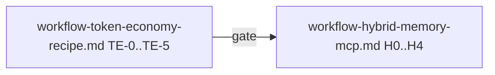

# Workflow: рецепт токен-экономии и shared KB (итерация постановки)

## Назначение документа и порядок с [`workflow-hybrid-memory-mcp.md`](workflow-hybrid-memory-mcp.md)

Этот файл — **первая очередь** ветки «токен-экономия + внешняя память»: здесь **постановка**, **история принятых решений**, **этапы TE-*** с критериями приёмки. Здесь **нет** задач на правку кода `ailit` (они начинаются во втором документе).

**Порядок выполнения (канон):**

1. Закрыть этапы **TE-0 … TE-5** в этом файле (или явно зафиксировать отложенные пункты с владельцем и датой).
2. Только после выполнения **критерия перехода** (раздел в конце) открывать и вести [`workflow-hybrid-memory-mcp.md`](workflow-hybrid-memory-mcp.md) (этапы **H0–H4** — проектирование интеграции и код).

Краткая схема:

---

## История решений (восстановление контекста)

Фиксируем то, что уже согласовано в обсуждении; при изменении — добавлять строку **с датой**, не переписывать прошлое.

| Дата | Событие |
|------|---------|
| 2026-04 | Зафиксирована цель: снизить расход контекста за счёт вынесения устойчивых знаний во внешний слой с детерминированным извлечением (MCP/KB). |
| 2026-04 | Выбран архитектурный паттерн **hybrid memory**: приватная рабочая память сессии + общий shared-слой (KB), без замены рабочей памяти «простынёй» чата. |
| 2026-04 | В таблицу локальных доноров добавлены пути: `obsidian-memory-mcp`, `hindsight`, `letta`, `graphiti` (см. [`.cursor/rules/project-workflow.mdc`](../.cursor/rules/project-workflow.mdc)). |
| 2026-04 | Создан второй workflow [`workflow-hybrid-memory-mcp.md`](workflow-hybrid-memory-mcp.md) для реализации после постановки. |

---

## Цель (не меняется без новой постановки)

Снизить расход контекста за счёт **вынесения устойчивых знаний** из «простыни» чата в **внешний слой памяти** с **детерминированным извлечением** (MCP / KB), не ломая локальную рабочую память агента.

## Выбранный паттерн: hybrid memory

- **Приватная рабочая память** (сессия, scratch, черновики) остаётся в runtime агента и не подменяется сырой выгрузкой логов в KB.
- **Общий слой (shared / KB)** хранит нормализованные факты, решения, инварианты, ссылки на артефакты — с явными **областями видимости** и политикой записи.

---

## Канонические ограничения (переносятся в реализацию без ослабления)

Эти пункты обязательны для любой последующей работы в [`workflow-hybrid-memory-mcp.md`](workflow-hybrid-memory-mcp.md):

1. **Области (scopes):** любая запись в shared-слой маркируется как минимум одним из уровней: `org` \| `workspace` \| `project` \| `agent` \| `run`. Детали наследования и полей — в этапах **H0** второго документа.
2. **Запрет сырого дампа:** полные логи чата, stack traces и неструктурированные простыни **не** пишутся в KB без нормализации (выжимка, класс сущности, ссылка на файл/коммит).
3. **Index-first retrieval:** перед подмешиванием большого объёма в промпт обязателен шаг поиска/ранжирования, а не «прочитать весь vault».
4. **Конфликты и версии:** правила приоритета при противоречии записей согласуются в постановке до расширения объёма кода (время, `supersedes`, ручное разрешение).

---

## Этап TE-0. Проблема и измеримость

### Задача TE-0.1 — Зафиксировать «боль» и единицы учёта

**Содержание:** что именно тратит контекст сегодня (повторяющиеся инструкции, дампы tool output, длинные логи); в чём измеряем успех (токены на turn, на сессию, доля «лишнего» в истории — выбрать минимум одну метрику для пилота).

**Критерии приёмки:**

- В этом файле или в ссылке на ADR есть 1 абзац «до» и перечень типовых источников шума.
- Названа **одна** метрика пилота и способ её снять (ручной подсчёт / лог провайдера — без привязки к коду до этапа H4).

### Задача TE-0.2 — Границы зоны ответственности

**Содержание:** что **не** входит в ветку (например, смена модели провайдера, полный редизайн чата) — короткий список non-goals.

**Критерии приёмки:**

- Минимум 3 пункта non-goals, согласованных с владельцем продукта или явно помеченных «предложение».

---

## Этап TE-1. Обзор вариантов и доноры

### Задача TE-1.1 — Карта вариантов хранения/доставки контекста

**Содержание:** сравнительная таблица: «всё в чате», RAG без политики записи, чистый KG, гибрид (текущий выбор), внешняя память MCP-only — без копипаста кода, со **ссылками на локальные репозитории** из [`.cursor/rules/project-workflow.mdc`](../.cursor/rules/project-workflow.mdc).

**Критерии приёмки:**

- Таблица ≥4 строк; у каждой строки есть «плюс / минус / когда уместно».
- Минимум **две** ссылки вида «путь к файлу + номера строк» на README доноров (как в разделе ниже).

### Задача TE-1.2 — Референсы для быстрого чтения

**Содержание:** закрепить «точки входа» в клонах (только пути, без дублирования README):

- Markdown + vault + `[[links]]`: `/home/artem/reps/obsidian-memory-mcp/README.md` (стр. 11–19).
- Фокус на обучении, не только на чате: `/home/artem/reps/hindsight/README.md` (стр. 20–23).
- Блоки памяти в API агента: `/home/artem/reps/letta/README.md` (стр. 47–62).
- Временной контекст-граф: `/home/artem/reps/graphiti/README.md` (стр. 42–55).
- Экономия через MCP и index-first: `/home/artem/reps/context-mode/README.md` (стр. 36–40).

**Критерии приёмки:**

- Список проверен: файлы существуют на машине разработчика или в CI указано «доноры не в репозитории — см. workflow».

---

## Этап TE-2. Фиксация выбранного паттерна

### Задача TE-2.1 — Запись о выборе hybrid memory

**Содержание:** явная формулировка: приватная память + shared KB; что остаётся в сессии, что выносится.

**Критерии приёмки:**

- Раздел «Выбранный паттерн» выше признан актуальным; при откате решения — новая строка в таблице «История решений» и обновление текста.

---

## Этап TE-3. Политики записи и чтения (постановка уровня продукта)

### Задача TE-3.1 — Классы знаний для KB

**Содержание:** перечень типов записей, которые **разрешены** в shared-слое (например: ADR-выжимка, инвариант API, чеклист релиза) и типы **под запретом** без нормализации.

**Критерии приёмки:**

- Два списка (allow / deny) по 5+ пунктов в сумме или явное «TBD» с владельцем и сроком.

### Задача TE-3.2 — Согласование с каноническими ограничениями

**Содержание:** проверить, что списки TE-3.1 не противоречат четырём ограничениям из раздела выше.

**Критерии приёмки:**

- Короткий чеклист «ограничение → как соблюдаем в KB» (таблица или список).

---

## Этап TE-4. Открытые вопросы постановки

### Задача TE-4.1 — Закрыть или отложить решения

**Содержание:** ответить на вопросы ниже **или** зафиксировать отложенное решение (владелец, срок пересмотра).

**Открытые вопросы:**

1. Один MCP на организацию vs отдельный экземпляр на workspace.
2. Обязательный Obsidian-vault vs достаточно SQLite/FTS без файловой визуализации.
3. Вторая продуктовая / тестовая KB: отдельный namespace (`bank_id` и т.п.) или отдельный деплой.

**Критерии приёмки:**

- По каждому вопросу: **ответ** или **DEFERRED** с полем даты пересмотра (формат `YYYY-MM-DD`) и именем владельца.
- После ответов — однострочное резюме перенести в начало [`workflow-hybrid-memory-mcp.md`](workflow-hybrid-memory-mcp.md) (раздел предусловий).

---

## Этап TE-5. Артефакты передачи во второй workflow

### Задача TE-5.1 — Матрица «постановка → этап H»

**Содержание:** явное сопоставление: результат TE-0…TE-4 какой задаче **H0–H4** кормит входными данными (одна таблица).

**Критерии приёмки:**

- Таблица: колонки `Артефакт постановки` | `Потребитель в hybrid workflow` | `Статус (готов/черновик)`.

### Задача TE-5.2 — Минимальный пакет для старта H0

**Содержание:** список артефактов, без которых **H0.1** (модель scopes) начинать нельзя (например: согласованный список scopes, ответы по org/workspace из TE-4).

**Критерии приёмки:**

- Список из ≥3 пунктов; все пункты в статусе «готов» либо с явным исключением, согласованным владельцем.

---

## Критерий перехода к [`workflow-hybrid-memory-mcp.md`](workflow-hybrid-memory-mcp.md)

Переход разрешён, только если выполнено:

1. Закрыты задачи **TE-0.1–TE-0.2**, **TE-1.1–TE-1.2**, **TE-2.1**, **TE-3.1–TE-3.2**, **TE-4.1**, **TE-5.1–TE-5.2** (галочки в коммите/PR или явная отметка даты в этом файле).
2. Нет противоречий между «Историей решений», каноническими ограничениями и ответами TE-4.
3. В [`workflow-hybrid-memory-mcp.md`](workflow-hybrid-memory-mcp.md) обновлён блок предусловий (см. тот файл) под актуальные ответы TE-4.

После перехода **новые** постановочные вопросы уровня продукта снова ведутся здесь (новая строка в истории + при необходимости этапы TE-6+), а реализация — во втором файле.

---

## Конец этого workflow

Если постановка исчерпана и **не** планируется работа по **H0–H4** — остановиться по [`.cursor/rules/project-workflow.mdc`](../.cursor/rules/project-workflow.mdc): запросить research и новую постановку.
